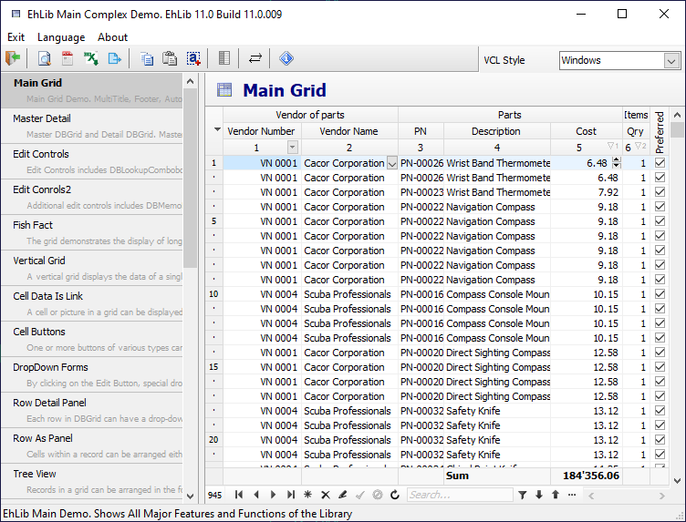

# Introduction

The Library contains components and classes for:
- [`Embarcadero Delphi`](https://docwiki.embarcadero.com/RADStudio/Alexandria/en/Main_Page) (Under the Windows framework - VCL)

- [`Embarcadero C++ Builder`](https://docwiki.embarcadero.com/RADStudio/Alexandria/en/Main_Page) (Under the Windows framework - VCL)

- [`Lazarus`](https://www.lazarus-ide.org/) (Under the Windows and Linux framework - LCL). 

The Library is intended to write professional interactive applications that work with the database: rendering tabular information, printing and entering data by the end user.

If you are just starting to learn the library, then start by running and viewing the compiled Demo projects.

You can download the compiled Demo projects from the library's website in the ["downloads"](https://www.ehlib.com/en/downloads) section.

The most comprehensive archive application is the EhLibDemos\Bin\MainDemo.Exe application.

You can also watch video reviews of some of the features of the library in the ["EhLib Video"](https://www.youtube.com/user/EhLibVideo) section on YouTube.
 

If you have already used previous versions of the library, then you can read a summary of new features and changes in the ["history"](https://www.ehlib.com/en/events) section.
 

If you have any problems, you can contact our technical support:
- Through the email support@ehlib.com
- Through the [Feedback Form](https://www.ehlib.com/en/feedback-28)
- Through the [Forum forum.ehlib.com](https://forum.ehlib.com/en/)
 

To start using the library, you can download the [evaluation version](https://www.ehlib.com/en/downloads) of the library and install it in the IDE.
 

To install the library in the IDE, use a special program - installer:
`.\Installer\EhLibInstaller.exe`

You can also install an evaluation version of the library using the [GetIt](https://getitnow.embarcadero.com/tag/EhLib/) service.

The evaluation version of the library has no usage time limits. When rendering a grid from an evaluation version, a warning about using the evaluation version is displayed at the bottom right of the grid.

