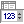
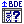
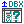
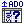
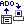
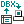

# List of library components and classes

## Data Grids

#### &nbsp;&nbsp;[TDBGridEh control](10-using-tdbgrideh-component/01-content.md)
The main and most sophisticated component of the library.
It provides all functionality of TDBGrid and adds several new features as follows:
- [Allows to select records, columns and rectangle areas](10-using-tdbgrideh-component/45-multiselect.md)
- [Provides special titles that can cover several or all columns](10-using-tdbgrideh-component/32-customizing-grid-title.md#complex-titles)
- [Can have a footer that is able to show sum/count/other field values](10-using-tdbgrideh-component/35-customizing-grid-footer.md)
- [Allows to resize column automatically to fit grid width equal to client width](10-using-tdbgrideh-component/08-moving-and-resizing-columns-in-the-grid.md)
- [Has an ability to change row height and title height](10-using-tdbgrideh-component/14-data-row-height.md)
- [Allows automatic broken of a single line long title and data rows to a multiline](10-using-tdbgrideh-component/32-customizing-grid-title.md#complex-titles)
- [Allows title to act as button and, optionally show a sort marker](10-using-tdbgrideh-component/32-customizing-grid-title.md)
- [Allows to mark titles by sortmarking sings automatically and sort data in DataSet](10-using-tdbgrideh-component/30-adjusting-grid-for-sorting-data.md)
- [Allows to truncate long text with ellipsis in cells](10-using-tdbgrideh-component/11-formatting-the-data-in-the-grid.md)
- [Allows lookup list to show several fields](10-using-tdbgrideh-component/05-types-of-columns-and-data-types-in-columns/04-configure-the-lookup-relationship-in-grid-columns.md)
- [Have an ability to make an incremental search in lookup fields](10-using-tdbgrideh-component/05-types-of-columns-and-data-types-in-columns/04-configure-the-lookup-relationship-in-grid-columns.md)
- [Can have frozen nonscrollable columns](10-using-tdbgrideh-component/44-frozen-zone.md)
- [Allows to show DateTime picker for TDateField and TDateTimeField](10-using-tdbgrideh-component/05-types-of-columns-and-data-types-in-columns/10-dropdown-calendar.md)
- Allows to show bitmaps from TImageList depending on field value
- [Allows to hide and track horizontal or vertical scrollbars](10-using-tdbgrideh-component/24-customizing-scrollbars.md)
- [Allows to hide columns](10-using-tdbgrideh-component/09-visibility-columns-in-the-grid.md)
- [Allows to show 3D frame for frozen, footer and data rows](10-using-tdbgrideh-component/49-other-features-and-events.md)
- [Allows to draw memo fields](10-using-tdbgrideh-component/05-types-of-columns-and-data-types-in-columns/09-draw-memo-fields.md)
- [Can show multiline inplace editor](10-using-tdbgrideh-component/11-formatting-the-data-in-the-grid.md)
- [Can have a proportional scrolling for DadaSets independently of dataset’s sequencing](10-using-tdbgrideh-component/24-customizing-scrollbars.md)
- [Allows to show checkboxes automatically for Boolean fields. Allows to show checkboxes for other type of fields](10-using-tdbgrideh-component/05-types-of-columns-and-data-types-in-columns/05-checkboxes.md)
- [Has procedures to save and restore layout (visible columns, columns order, columns width, sortmarkers, row height) in/from registry or ini file](10-using-tdbgrideh-component/43-storing-settings.md)
- [Allows to show hint (ToolTips) for text that don't fit in the cell](10-using-tdbgrideh-component/36-hints-and-tooltips.md)
- [Allows to export data to Text, Csv, HTML, RTF, XLS and internal formats](10-using-tdbgrideh-component/04-import-export-tdbgrideh-data-to-from-various-formats.md)
- [Allows to import data from Text and internal formats](10-using-tdbgrideh-component/04-import-export-tdbgrideh-data-to-from-various-formats.md)
- [Can sort data in various datasets](10-using-tdbgrideh-component/30-adjusting-grid-for-sorting-data.md)
- [Can filter data in various datasets](10-using-tdbgrideh-component/31-adjusting-grid-for-filtering-data.md)
- [Allows to group data in memory using columns as a grouping criterions](10-using-tdbgrideh-component/20-working-with-data-grouping-mode.md)

#### &nbsp;&nbsp;[TDBVertGridEh control](12-dbvertgrideh-component/01-dbvertgrideh-component.md)
TDBVertGridEh сomponent is a Vertical Grid. 

The component is used to display and edit a single record DataSet in a vertical orientation. The data is displayed in two columns. The first column displays the names of the fields in the second field values of the current record.

## Edit controls

#### &nbsp;&nbsp;[TDBLookupComboboxEh control](14-edit-controls/16-tdblookupcomboboxeh-control.md)
TDBLookupComboBox represents a combo box that identifies a set of field values in one dataset with a corresponding set of values from another dataset.

#### &nbsp;&nbsp;[TDBEditEh control](14-edit-controls/01-edit-controls.md)
represents a single or multi-line edit control that can display and edit data of field in a dataset or can work as non data-aware edit control.

#### &nbsp;&nbsp;[TDBDateTimeEditEh control](14-edit-controls/08-tdbdatetimeediteh-control.md)
represents a single-line date or time edit control that can display and edit data of TDateTime fields in dataset or can work as a non data-aware edit control.

#### &nbsp;&nbsp;[TDBComboBoxEh control](14-edit-controls/10-tdbcomboboxeh-control.md)
represents a single or multi-line edit control that combines an edit box with a scrollable list and can display and edit a field in a dataset or can works as non data-aware combo edit control.

#### &nbsp;&nbsp;[TDBNumberEditEh control](14-edit-controls/09-tdbnumberediteh-control.md)
Represents a single-line number edit control that can display and edit a numeric field in a dataset or can work as non data-aware edit control.

####  &nbsp;&nbsp;[TDBMemoEh control](14-edit-controls/11-tdbmemoeh-control.md)
The component is designed for editing multi-line text data.
The component can operate in Data-Aware mode (connected to DataSet), and can work as non data-aware edit control.

#### &nbsp;&nbsp;[TDBImageEh control](14-edit-controls/12-tdbimageeh-control.md)
The component is designed for editing a graphic data.
The component can operate in Data-Aware mode (connected to DataSet), and can work as non data-aware edit control.

#### &nbsp;&nbsp;[TDBRadioGroupEh control](14-edit-controls/13-tdbradiogroupeh-control.md)
The component is a set of selection flags (radiobuttons).
The component can operate in Data-Aware mode (connected to DataSet), and can work as non data-aware edit control.

#### &nbsp;&nbsp;[TDBRichEditEh control](14-edit-controls/14-tdbrichediteh-control.md)
The component is designed for editing multi-line text data with the ability to format it as RichText.
The component can operate in Data-Aware mode (connected to DataSet), and can work as non data-aware edit control.

## Printing, Preview, Export to Pdf

#### &nbsp;&nbsp;[TPrintDBGridEh component](11-printdbgrideh-component/01-content.md)
TPrintDBGridEh provides properties and routines for preview, print of TDBGridEh component. It also allows to export
TDBGridEh to pdf file.

#### &nbsp;&nbsp;[TPreviewBox component]
TPreviewBox lets you to create a customizable runtime preview.

#### &nbsp;&nbsp;[TPrinterPreview class]		
TPrinterPreview lets you to record printable data in buffer for following output them on screen and to printer. TPrinterPreview have all functions and properties as in TPrinter object. You can use TPrinterPreview object similarly to TPrinter except some details. In TPrinter Printer.Canvas.Handle and Printer.Handle is the same but in TPrinterPreview PrinterPreview.Canvas.Handle represents the metafile in that is recored the data and PrinterPreview.Handle represents Printer.Handle. It means that you have to use PrinterPreview.Canvas.Handle for drawing operation (like DrawText, DrawTexteEx, e.t.c.) and use PrinterPreview.Handle for such functions as returning information about printer facilities (GetDeviceCaps, e.t.c.). Global function PrinterPreview returns default PrinterPreview object and shows data in the default preview form.

#### &nbsp;&nbsp;[TPdfPrinterEh class](23-generating-pdf-files-using-the-printer-class.md)
The library has a global method - PdfPrintersEh.PdfPrinter for accessing a class of TPdfPrinterEh type with which you can generate Pdf files similar to how printed documents are generated using the global method - Printers.Printer.

#### &nbsp;&nbsp;[TVirtualPrinter class]
The library has a global method - PrntsEh.VirtualPrinter of TVirtualPrinter type. PrntsEh.VirtualPrinter function allows to print graphic data on a printer. The function works similarly to the Vcl.Printers.Printer function from the VCL library and has additional features such as redirecting the print stream to a preview window (TPreviewBox) or to a Pdf file.

## DataSet

#### &nbsp;&nbsp;[TMemTableEh component](27-tmemtableeh-component/01-tmemtableeh-component.md)
It is a dataset that holds all data in memory. It can work as a standalone DataSet or receive data from other DataSets via the TDataDriverEh component.

## Data provider components for TMemTableEh

#### &nbsp;&nbsp;[TDataDriverEh component](28-tdatadrivereh-component.md)
Deliver records from the server or other DataSet to the TMemTableEh.
Deliver changed records from TMemTableEh back to the server. 

#### &nbsp;&nbsp;[TDataSetDriverEh component]
It is a DataDriver that deliver records in TMemTableEh from other DataSet and deliver changed records from TMemTableEh back to the DataSet.

#### &nbsp;&nbsp;[TSQLDataDriverEh component](29-tsqldatadrivereh-component/01-content.md)
It is a DataDriver that have properties for keeping five SQL expressions and parameters for querying data, removing, insertions, updating and refreshing records. TSQLDataDriverEh by itself can’t request data from server, but it can prepare parameters of the request and have a global event that programmer can write for transferring SQL expression to/from the server.

#### &nbsp;&nbsp;[TBDEDataDriverEh component](29-tsqldatadrivereh-component/02-tsqldatadrivereh-component.md)
It is a DataDriver that interacts with the DB server using BDE connection.

#### &nbsp;&nbsp;[TIBXDataDriverEh component](29-tsqldatadrivereh-component/02-tsqldatadrivereh-component.md)
It is a DataDriver that interacts with the DB server using IBX connection.

#### &nbsp;&nbsp;[TDBXDataDriverEh component](29-tsqldatadrivereh-component/02-tsqldatadrivereh-component.md)
It is a DataDriver that interacts with the DB server using DBX connection.

#### &nbsp;&nbsp;[TADODataDriverEh component](29-tsqldatadrivereh-component/02-tsqldatadrivereh-component.md)
It is a DataDriver that interacts with the DB server using ADO connection.

#### &nbsp;&nbsp;[TADOConnectionProviderEh component](29-tsqldatadrivereh-component/06-uisng-connection-provider.md)
Provides the interface between the component TADODataDriver and TADOConnection in Design-Time and Run-Time. Contains inbuilt TADOConnection component. Specifies the type of server data for the correct operation of additional server operations, such as getting the value of the incremental table fields after inserting record, etc.

#### &nbsp;&nbsp;[TDBXConnectionProviderEh component](29-tsqldatadrivereh-component/06-uisng-connection-provider.md)
Provides the interface between TDBXDataDriver and TSQLConnection in Design-Time and Run-Time. Contains embedded TSQLConnection component. Specifies the type of server data for the correct operation of additional server operations, such as getting the value of the incremental table fields after inserting record, etc.

#### &nbsp;&nbsp;[TIBXConnectionProviderEh component](29-tsqldatadrivereh-component/06-uisng-connection-provider.md)
Provides the interface between the component TIBXDataDriver and TIBDatabase in Design-Time and Run-Time. Contains built TIBDatabase component.
TBDEConnectionProviderEh component		 
Provides the interface between the component TBDEDataDriver and TDatabase in Design-Time and Run-Time. Contains inbuilt TDatabase component. Specifies the type of server data for the correct operation of additional server operations, such as getting the value of the incremental table fields after inserting record, etc.

## Components for consolidated data analysis

#### &nbsp;&nbsp;[TPivotDataSourceEh component](30-components-for-consolidated-data-analysis/01-components-for-consolidated-data-analysis.md)
Downloads and store pivot data.

#### &nbsp;&nbsp;[TPivotGridEh control](30-components-for-consolidated-data-analysis/01-components-for-consolidated-data-analysis.md)
Component-control to display pivot data.

#### &nbsp;&nbsp;[TPivotGridToolBoxEh control](30-components-for-consolidated-data-analysis/01-components-for-consolidated-data-analysis.md)
Component-control for configuration data structure and sections stored in the PivotDataSource component.

## Components for planning and visual interactive event management

#### &nbsp;&nbsp;[TPlannerDataSourceEh](31-components-for-planning-management/01-components-for-planning-and-event-management.md#component-tplannerdatasourceeh)
The component is used to store event objects such as TPlannerDataItemEh.

#### &nbsp;&nbsp;[TPlannerControlEh](31-components-for-planning-management/01-components-for-planning-and-event-management.md#component-tplannercontroleh)
The visual component-container TPlannerControlEh contains a set of visual components PlannerView.

#### &nbsp;&nbsp;[TPlannerCalendarPickerEh](31-components-for-planning-management/01-components-for-planning-and-event-management.md#component-tplannercalendarpickereh)
The visual component-calendar is designed to navigate through the days of the month.

## Components for exporting/importing data to/from DataSet from/to a text file.

#### &nbsp;&nbsp;[TDataSetTextExporterEh component](33-components-for-uploading-data-set-text.md)
Component for uploading data from a DataSet to a text file for later downloading from it.

#### &nbsp;&nbsp;[TDataSetTextImporterEh component](33-components-for-uploading-data-set-text.md)
Component for downloading data from Text file to DataSet it.

## Other components and classes

#### &nbsp;&nbsp;[DropDownForms - custom drop-down windows](20-drop-down-forms.md)
The technology allows you to create a customizable drop-down windows that appears when user click on the button (EditButton) in TDBEditEh, TDBNumberEditEh, TInplaceEditor in DBGridEh etc. components.

#### &nbsp;&nbsp;[TDBSumList component](13-using-tdbsumlist-component.md)
TDBSumList is intended for calculating sums and amount of records in a TDataSet with dynamic changes. Component keeps a list of TDBSum objects, which contains types of group operations (Sum, Avg, Count, Min, Max) and name of fields which values need some calculation.

#### &nbsp;&nbsp;[TXlsMemFileEh class](32-txlsmemfileeh/00-content.md)
Allows you to create `Xlsx` files without the participation of installed `MSOffice` modules.

