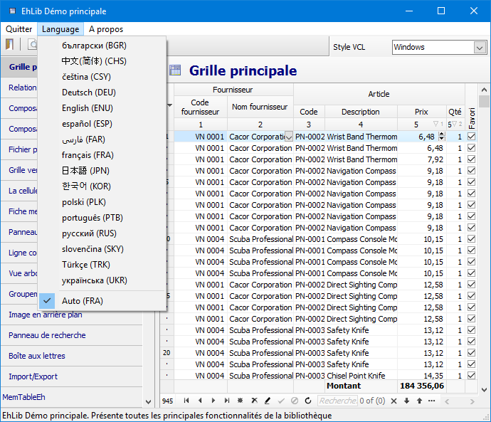

# Language resources

`Delphi` standard recommends use resourcestring and individual versions of dfm files for strings that are language-dependent constant.

EhLib since version 9 uses a slightly different technology for storing language resources.
1.	Constants of resourcestring type are not used.
2.	All string resources are stored in one file - `EhLibLangConsts.dfm` and `EhLibLangConsts.XXX.dfm` files for each language.
3.	Language strings are stored as properties of `TEhLibLanguageConsts` class.

This technology has the following advantages:
1.	Language resources can be downloaded at any time while the program is running.
2.	The language can be set as an end user and selected automatically.
3.	Language resources can be stored as separate files, so embed in an exe file.





All string library constants that depend on the language are stored in the properties of the class `TEhLibLanguageConsts` (source files `EhLibLangConsts.dfm` + `EhLibLangConsts.pas`)

To access a class object, use the global function `EhLibLanguageConsts: TEhLibLanguageConsts`.
Versions of strings in other languages are stored in similar files with the corresponding name 

```
EhLibLangConsts.ENU.dfm
EhLibLangConsts.FRA.dfm
EhLibLangConsts.RUS.dfm
EhLibLangConsts.UKR.dfm
...
```     

in folder `<EhLib archive >\LangResources\Res\`
When installing the library in the IDE, the files in this folder should be copied to the folder `<EhLib installed dir>\Lib\`
If the file for your language is not in the folder, you can create it. To do this, copy the file `EhLibLangConsts.ENU.dfm` to a new file `EhLibLangConsts.XXX.dfm` where `XXX` is the three-letter language code. Using a text editor, change the text in the `dfm` file to the desired text.
The three-letter language code can be found in the table at the following address:
https://www.microsoft.com/resources/msdn/goglobal/default.mspx
Inside the file, also change the class name from `TEhLibLanguageConsts_ENU` to the new name `TEhLibLanguageConsts_XXX` (where XXX is the three-letter language code).

While the program is running while changing the language, the algorithm finds the desired language file by three-letter code and loads into the EhLibLanguageConsts object as an external dfm resource or for embedded resources by the last three characters in the name of the resource `TEhLibLanguageConsts_XXX`.
Inside the program, the following code is used to change the language
	
```pascal
  LanguageResourceManagerEh.ActiveLanguageAbbr := 'THREE-LETTER CODE'.
```

To select the language automatically, use the following code
```pascal
LanguageResourceManagerEh.ActiveLanguageAbbr := LanguageResourceManagerEh.AutoselectLanguage();
```

  The language is chosen based on the variable - `System.SysUtils.SysLocale.DefaultLCID`
  If the appropriate files or the built-in resource for the selected language was not found, the default language is downloaded from the built-in resource described in the `EhLibLangConsts.dfm` file. The EhLibLangConsts.dfm file links into the EXE file at compile time.

### Working with language resources through external files

When loading resources from a file, the algorithm looks for a file with a name:
	`<EXE File Placment>\Res\EhLibLangConsts.[XXX].dfm`

Where `XXX` is a three-character language code.
You can configure the resource download folder by assigning a global variable 
     `LanguageResourcesEh.LanguageResourcesFolder: String`

To use additional resources in your application, you must supply the `EhLibLangConsts.XXX.dfm` files along with the `EXE` file.

The files in the Res folder are stored in the Utf8 encoding.
For the work of this technology in `Delphi7-Delphi2005` for these versions of Delphi, similar files are stored in the Res.Ansi folder in the Ansi encoding.

In the code of the program you can download a list of available resources for downloading the language using the code
```pascal
LanguageResourceManagerEh.LoadListOfAvailableLanguages('EhLibLangConsts');
```

The algorithm will scan the ```\Res``` folder for ```EhLibLangConsts.[XXX].dfm``` files and fill in the internal property of ```EhLibLanguageConsts.LanguageList```.
To access the list of available languages, use the property ```LanguageResourceManagerEh.LanguageList```

### Create language resources for the language constants of your application

You can also use the technology of storing language dependent constants to store the strings of your application.
For this
1. Create a class that inherits from TComponent and write in it in the published section whose properties the values in your application depend on the language.
      (For an example, see the ```AppLangConsts.pas``` file from the Demo application ```DEMOS\MainDemo\``` ) 

```pascal
  TApplicationLanguageConsts = class(TComponent)
  ..
  public
    constructor Create(AOwner: TComponent); override;
  published
    property Caption: String read FCaption write SetCaption;
    property MenuFile: String read FMenuFile write FMenuFile;
  end;
```

In the class constructor, load the values of the constants that will be used by default using next code:

```pascal
  constructor TApplicationLanguageConsts.Create(AOwner: TComponent);
  begin
    inherited Create(AOwner);
    InitInheritedComponent(Self, TCustomControl);
  end;
```

2. Create a resource dfm file (AppLangConsts.dfm) to store the property values of the class

```pascal
  object TApplicationLanguageConsts
    Caption = 'EhLib Main Complex Demo'
    MenuFile = 'File'
  end
```

write  the dfm file as the resource of your application

```pascal
  {$R AppLangConsts.dfm}
```

3.
Create files   
```
  AppLangConsts.ENU.dfm
  AppLangConsts.BGR.dfm
  AppLangConsts.CHS.dfm
  AppLangConsts.CSY.dfm
  AppLangConsts.DEU.dfm
...
```

By analogy with the files EhLibLangConsts.XXX.dfm

4. Once in the program code, create a variable for storing resources 

```pascal
  FApplicationLanguageConsts := TApplicationLanguageConsts.Create(nil);
```

5. Once in the program code, register the resource in LanguageResourceManager
```pascal
  LanguageResourceManagerEh.AddLocalizableObject(FApplicationLanguageConsts,
       FApplicationLanguageConsts.ClassName, 'AppLangConsts', 'ENU');
```

When changing the language, the `WM_SETTINGCHANGE` event is sent to all forms and controls.

### Default language resource

There is a concept - the built-in library language by default.
If you do not perform any actions to change the language in the application, then the default language resource in the library is used.
To change the default built-in language for all programs used:
1.	Copy the `LangResources\Res\EhLibLangConsts.XXX.dfm` file to the installed library folder in the `Lib\EhLibLangConsts.dfm` file.
2.	Delete the first line of the file with the suffix `_XXX` in the name of the class so it will look like the following: `object TEhLibLanguageConsts`
3.	Recompile the library packages.
When the library is installed with `EhLibInstaller.exe`, the program performs this action automatically.

### Demo projects using dynamic language resources loading

For an example of using built-in and external resources, see the Demo project 

```
DEMOS\LanguageResEmbeddedExternal\Project1.dpr
```

In the `Unit1.pas` file, you can comment out or uncomment the lines
```pascal
{$DEFINE EMBEDDED_LANGUAGE_RESOURCES} 
{$DEFINE EMBEDDED_LANGUAGE_RESOURCES_ALL}
```

To change the mode of using resources and understand the difference in working with built-in and external resources.
For detailed information on how to use the specified DEFINE definitions to change the resource usage mode, see the file

`Demos\LanguageResEmbeddedExternal\Info.Txt`

Another example of the use of dynamic loading of language resources can be seen in the Demo project 

`DEMOS\MainDemo\Project1.dpr`

The main methods used in the project for working with language resources are as follows:

`procedure AppLangConsts.InitUnit;`
<sh>Registers the class TApplicationLanguageConsts in which the application's string resources will be stored.</sh>
<br>

`procedure TForm1.InitLanguageRes;`
  <sh>Loads the list of available languages.<br/>
Activates the language from the Ini file if it was selected the last time the program was started.</sh>
<br>

`procedure TForm1.BuildLanguageMenu;`
<sh>Forms a menu of available languages based on the LanguageResourceManagerEh.LanguageList object</sh>
<br>

`procedure TForm1.MenuItemSelectLanguage(Sender: TObject);`
<sh>Loads files of a new language when the user selects another language in the menu.</sh>
<br>

`procedure TForm1.ResourceLanguageChanged;`
<sh>Assigns properties and form variables when the language has been changed.</sh>
<br>


