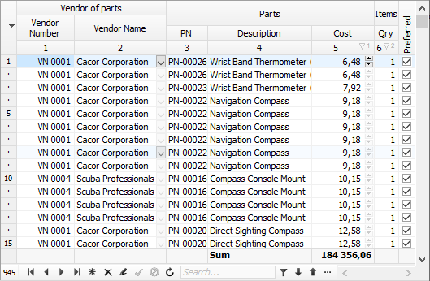

# Brief description of TDBGridEh

`TDBGridEh` displays and manipulates records from a dataset in a tabular grid.

`TDBGridEh` is very similar to the standard TDBGrid component, but `TDBGridEh` does not inherit from TDBGrid or TCustomDBGrid.
The `TDBGridEh` inheritance tree looks like this:

`TWinControl`  
&emsp;`TCustomControl`  
&emsp;&emsp;`TCustomControlEh`  
&emsp;&emsp;&emsp;`TCustomGridEh`  
&emsp;&emsp;&emsp;&emsp;`TCustomDBAxisGridEh`  
&emsp;&emsp;&emsp;&emsp;&emsp;`TCustomDBGridEh`  

`TDBGridEh` supports all the features of the `TDBGrid` component and also includes many additional features.

Some features of `TDBGridEh` only work when the grid is connected to a DataSet of type `TMemTableEh`. `TMemTableEh` is a `DataSet` that contains all the records in the computer's memory and is not connected directly to the database. TMemTableEh can be connected to other DataSets that can connect to the database. When working in conjunction with `TDBGridEh`-`TMemTableEh`-`TDataSetDriverEh`-`<Your Dataset>`, you will be able to work in the database and use all the features of `TDBGridEh` that it has when working with `TMemTableEh`.

When `TDBGridEh` is connected to `TMemTableEh`, then `TDBGridEh` has the following additional features such as:

- Ability to scroll the grid through a vertical scrollbar without changing the current record
- Ability to create virtual group entries that appear as one wide entry in the grid. Group entries are created based on the repeated values of entries in a particular column.
- Possibility to build a list of unique values in drop-down filtering lists.
- Possibility to display data in the form of a tree. The tree structure is configured in the TMemTableEh component.

`TDBGridEh` does not store data in itself, it only displays the data of a TDataSet via a TDataLink object. Each DataSet component has an internal TDataLink object. You can connect `TDBGridEh` to a DataSet using an additional `TDataSource` object and the `TDBGridEh.DataSource` property. By itself, the intermediate TDataSource object carries little semantic load when interacting with `DBGridEh` and `DataSet`. It will rarely be mentioned in the documentation. If you have already used the TStringGrid component, you may have noticed that the data displayed in `TStringGrid` and `TDBGridEh` are very similar, but the mechanisms that are used to display data in `TStringGrid` and `TDBGridEh` are completely different. In `TStringGrid` the total number of grid rows is equal to the number of data rows in the array, while in `TDBGridEh` (and `TDBGrid`) the number of rows is never greater than the number of visible rows. While the vertical `ScrollBar` can display position relative to the total number of records in the DataSet, it takes its position data not from the grid's cell array, but directly from the `DataSet` (`DataSet.RecNo`). A similar feature or flaw has been fixed in the `DataSet` of the `TMemTableEh` type, but, in general, it is preserved for other types of DataSets that you will work with.

`TDataSet` does not allow you to work with data as with an array of data, for example, it is impossible to immediately get the field value by the record index. Also, some types of DataSets don't even have the concept of a record number (`DataSet.RecNo`). In such DataSets, we can only know when we are at the beginning, or at the end of the DataSet, or somewhere in between, and in this case, the `DBGrid` only shows a vertical ScrollBar in 3 positions (in `TDBGridEh` to work with such DataSets' You can activate the `SumList` object and set the `SumList.VirtualRecords` property to `True`). To be able to display multiple records at the same time, the `TDataLink` object uses a record buffer window with fast read-only access. `DBGrid` takes advantage of this `DataLink` feature and sets the size of the record buffer window to the number of possible visible grid rows. `DataLink` does not allow to define from what record in `DataSet` this buffer is filled. The `DataLink` itself scrolls the contents of the record buffer window as we move through the `DataSet` (`Next`, `Prior`) so that the active record always remains inside the record buffer window. This is the reason why the active entry changes position when users change the `ScrollBar` position with the mouse.
