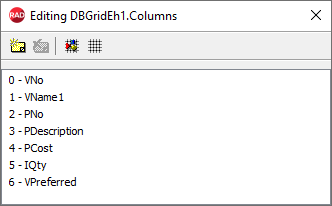
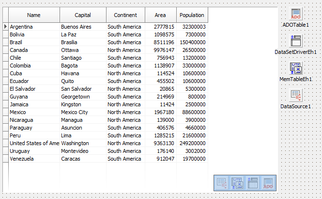

# Working with TDBGridEh at design-time

  `TDBGridEh` contains rows and columns. Every row is a record in `TDataSet`. Every column is a field in `TDataSet`. Columns can be dynamic or static. Dynamic columns are recreated every time when the state of DataSet is changed. `State` of `DataSet` can be changed in several cases. It is changed when, for example, `DataSet` is reopened. When column is recreated, values of column properties are reset to their default values. It is useful to use dynamic columns when the list of fields of `DataSet` is not known in advance. In the mode of static columns grid itself never recreates columns. At design-time to create static columns you need to double-click on the grid. The `Columns Editor` window will be open. Press `Add all fields` in this window. Grid will create static column for every `DataSet` field. 
   
   

To customize properties of column you need to select its name in the The `Columns Editor` window. You can also select column in `Object Inspector` by clicking column title in the grid. If grid is connected to `DataSource` and `DataSource` is placed on the same Form as grid, then icon of `DataSource` will be shown in the bottom right corner of the Grid. You can click on the `DataSource` icon to select `DataSource` in `Object Inspector`. In same manner grid can show `DataSet`. If a `DataSet` is a `TMemTableEh` then grid also can show `TDataDriver` and `DataSet` which is connected to `DataDriver` as a `ProviderDataSet`.
