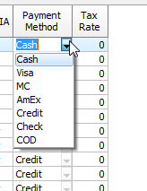

# Columns with editor of a Combobox type

The column data type Combobox Editor is a column in which the data is opened for editing text editor with the ability to select data from the drop-down list. In the right part of column the editor shows the special button – DropDownEditButton. When clicked, it displays a drop-down list. 

When the grid has a column of Combobox type it is convenient have edit buttons be always displayed in the column of the grid, but not only within the text editor in the cell.

To customize the display of buttons, use the following properties:
-	`TDBGridEh.ColumnDefValues.AlwaysShowEditButton`
-	`TColumnEh.AlwaysShowEditButton`
-	`TDBGridEh.EditButtonsShowOptions`

For more details on the edit button, see Working with edit buttons.

Using the properties of the column and the type of field you can configure Column for four main types Comboboxes:

##### PickList Combobox 
For this combobox the data for a drop-down list are taken from the TColumnEh.PickList property. To activate this type combobox just fill TColumnEh.PickList property by list of possible values. In this mode the drop-down list can contain only one column, can not display headers or special row SpecRow.

##### DataList Combobox
For this type of combobox the data for a drop-down list are taken from a DataSet specified by TColumnEh.DropDownBox.ListSource property. To activate this type of combobox assign TColumnEh.DropDownBox.ListSource property by a DataSource which indicate a DataSet with a list of values.

##### KeyPickList Combobox
This mode uses two lists - KeyList and PickList. KeyList contains values that are stored in the field specified by TColumnEh.FieldName ptoperty, and PickList - in the relevant index contains the value to be displayed in the column and list. You can also set a Column.NotInKeyListIndex property by the index from PickList property, which is displayed if the value of the field is not contained in KeyList (for example, you can specify the index for Null-field value). You can also set Column.DblClickNextval to True, to allow users to change the value by double-clicking the mouse.

##### LookupCombobox
In this mode, the data for the list are set through a field TField justified as a lookup field or through the subproperties of TColumn.LookupParams property. See more details about this mode in the next section "Configuring lookup relationship in columns grid"

Use the following properties of TColumnEh (or TFieldRow for DBVertGridEh) for advanced configuration and work with LookupCombobox and DataList Combobox:

`TColumnEh.CaseInsensitiveTextSearch`
<dd>Specifies that the text search in the drop down list is case-insensitive.</dd>

`TColumnEh.LimitTextToListValues`
<dd>limits the ability to enter text only by a text from the list.</dd>

If `TColumnEh.LimitTextToListValues = False`, then after you enter the text that is not in the list and attempt to leave the cell, or press `Enter` the `TColumnEh.OnNotInList` event is triggered. The event handler is passed the entered text – `NewText` argument. You can add text to the list. If the list is based on data from the `DataSet`, the new value should be added in the `DataSet`. After values is added in the `DataSet` set `RecheckInList` property to `True`. For `Combobox` of `LookupCombobox` type the grid re-perform lookup search the list and write the data to the cell.
