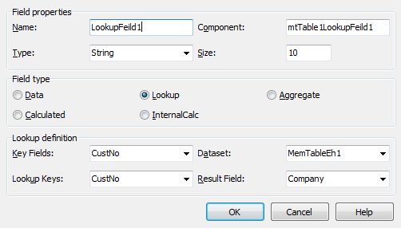
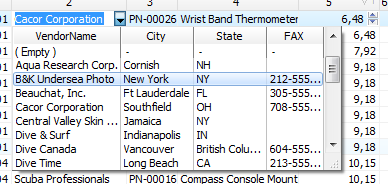

# Configure the lookup relationship in grid columns

#### General concepts about lookup fields.
Before describing the possiblites of the grid when working with lookup fields, lets consider what is a lookup field in terms of the standard `TField` class. Lookpup field – is a field of `DataSet` with a `TField` configured in such a way that it show text from the dictionary field basing on the code of a key field of dataset. The second DataSet serves as a dictionary. Typically, lookup fields are created at the Design-Time based on field DataSet selected from the database. When configuring fields in the `DataSet` the designer creates a Persistent field based on the selected fields from the database, and then adds calculated and lookup fields. To configure the lookup field, you can use a dialog to add a new field in `DataSet`.

You can also fill TField properties in the Object Inspector as follows:
 - Set `FieldKind = fkLookup`
 - Set `KeyField` to the field name that contains the code values in the original DataSet
 - Set `LookupDataSet` to DataSet that contains dictionary values
 - Set `LookupKeyFields` to a field name that contains the code values in the dictionary DataSet 
 - Set `LookupResultField` to a field name in dictionary DataSet whose content should be displayed instead of the code.

#### Lookup columns in the grid.
DBGridEh and DBVertGridEh automatically determine then Field.FieldKind is lookup and create a cell with a dropdown list so that it looks like a LookupComboBox.

In addition, the column (`TColumnEh` and `TFieldRow`) contain additional properties for the empowerment of working with lookup fields.

To display multiple fields in the drop-down list  fill the Column.LookupDisplayFields property by the list of field names separated by a semicolon - `;`.
By default, the drop-down list displays a single column with the value specified in the field `TField.LookupResultField`. You can customize the list so that it displays multiple fields from the DataSet specified property TField.LookupDataSet.

- Method 1: Fill `TColumnEh.DropDownBox.ListFieldNames` property by the list of fields. Several fields are separated by semicolons - `;`.

- Method 2: Fill `TColumnEh.DropDownBox.Columns` collection with elements. With this method, you can also customize the font and the other a property of each column drop-down list.

#### Configure lookup relationships directly into the grid column.
`DBGridEh` and `DBVertGridEh` has the ability to create lookup relationships directly into grid columns. To do this, use the sub-properties of `TColumn.LookupParams` property. Fill in the sub-properties similar to how it is configured in the TField. In this case, leave TColumn.FieldName property empty.
The `TColumn.LookupParams` property has the following subproperties:
 

`property KeyFieldNames: String`
<dd>Defines a field (or fields) in Grid.DataSource.DataSet that specifies the value to search LookupDataSet. Several fields are separated by ';'.</dd>
 

`property LookupCache: Boolean`
<dd>Specifies whether to copy the key values in the internal buffer to speed up the operation of drawing a grid of cells.</dd>
 

`property LookupDataSet: TDataSet`
<dd>Specifies the dataset record values to be displayed in the lookup control instead of the field KeyField</dd>
 

`property LookupDisplayFieldName: String`
<dd>Specify the field whose value will be displayed on the screen.</dd>
 

`property LookupKeyFieldNames: String`
<dd>Defines a field (or fields) in LookupDataSet value will be used to search records for the value of the field specified by KeyFieldNames property.</dd>
 

With a large number of customized lookup columns in the grid, drawing data may be slow because Search lookup values occurs in each cell drawing. But drawing can be accelerated, if you use TMemTableEh as a DataSet. MemTableEh provides the ability to create in DBGridEh associated buffer values found and dynamically update it as a data changes in MemTableEh.
