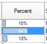

# Drawing of a ProgressBar


Grid doesn't allow customizing column to show ProgressBar shaped image, but there is a procedure DrawProgressBarEh in the ToolCtrlsEh module. You can use it to draw image of ProgressBar when an event of custom drawing of a Grid's cell is used.




Below you can see an example of using of the DrawProgressBarEh procedure:

```pascal:no-line-numbers
procedure TForm1.DBGridEh6Columns3AdvDrawDataCell(Sender: TCustomDBGridEh;
  Cell, AreaCell: TGridCoord; Column: TColumnEh; const ARect: TRect;
  var Params: TColCellParamsEh; var Processed: Boolean);
begin
  Sender.DefaultDrawColumnDataCell(Cell, AreaCell, Column, ARect, Params);

  DrawProgressBarEh(mtTable1.FieldByName('ItemsTotal').AsFloat, 0, 50000, 
     Sender.Canvas, ARect, clSkyBlue, cl3DDkShadow, clNone);
  Processed := True;
end;
``` 
<br>

Procedure DrawProgressBarEh has next parameters:
<br>

`CurrentValue: Double;`
<sh>Current value of the DrawProgress position.</sh>
<br>

`MinValue: Double;`
<sh>Minimum value of the DrawProgress position. The value is used to calculate the current percentage.</sh>
<br>

`MaxValue: Double;`
<sh>Maxinum value of the DrawProgress position. The value is used to calculate the current percentage.</sh>
<br>

`Canvas: TCanvas;`
<sh>The canvas that is used for rendering. Here you need to pass the canvas of the grid.</sh>
<br>

`const Rect: TRect;`
<sh>The rectangle inside which the DrawProgress is drawn.</sh>
<br>

`Color: TColor;`
<sh>The color of the progress bar that paints the completed part of the process.</sh>
<br>

`FrameColor: TColor;`
<sh>The border color of the completed part of the progress bar.</sh>
<br>

`BackgroundColor: TColor;`
<sh>The color of the entire background of the progress bar.</sh>
<br>

`const PBParPtr: PProgressBarParamsEh = nil`
<sh>Pointer to advanced rendering options for the progress bar. This is not a required parameter. You can also pass nil as a parameter to indicate that advanced options are not used.</sh>
<br>

Extended options are of the following type:

```pascal:no-line-numbers
PProgressBarParamsEh = ^TProgressBarParamsEh;
  TProgressBarParamsEh = record ...
```
<br>

`TProgressBarParamsEh` has the following fields:

`ShowText: Boolean;`
<sh>Whether to show the progress percentage value.</sh>
<br>

`TextType: TProgressBarTextTypeEh;`

`TProgressBarTextTypeEh = (pbttAsValue, pbttAsPercent);`
<sh> <code>pbttAsValue</code> - display the value passed in the CurrentValue parameter.</sh>
<br>
<sh> <code>pbttAsPercent</code> - Display the value as a percentage calculated using the formula MaxValue - MinValue = 100%.</sh>
<br>

`TextDecimalPlaces: Byte;`
<sh> Round the value to a decimal point.</sh> 
<br>

`TextAlignment : TAlignment;`
<sh> Percent text alignment.</sh> 
<br>

`FrameFigureType: TProgressBarFrameFigureTypeEh;`

`TProgressBarFrameFigureTypeEh = (pbfftRectangle, pbfftRoundRect);`
<sh> Border type.
 <br> <br>
 <code>pbfftRectangle</code> - Rectangle.
 <br> <br>
 <code>pbfftRoundRect</code> - Rectangle with rounded corners.</sh> 
<br>

`FrameSizeType: TProgressBarFrameSizeTypeEh;`

`TProgressBarFrameSizeTypeEh = (pbfstFull, pbfstVal);`

<sh>
The drawing area of the border.

 <code>pbfstFull</code> - A border is drawn around the entire area of the progress bar.

 <code>pbfstVal</code> - The border is drawn around the completed area of the progress bar.
</sh> 

`Indent: Byte`
<sh>The size of the indent from the cell borders.</sh><br>

`FontName: String;`
<sh>The name of the font to display the progress percentage.</sh><br>

`FontColor: TColor;`
<sh>Font color.</sh><br>

`FontSize: Integer;`
<sh>Font size.</sh><br>

`FontStyle: TFontStyles;`
<sh>Font style.</sh><br>

Code example:

::: normal-demo Full Demo code

```pascal:no-line-numbers
procedure TForm1.DBGridEh1Columns5AdvDrawDataCell(Sender: TCustomDBGridEh; Cell,
  AreaCell: TGridCoord; Column: TColumnEh; const ARect: TRect;
  var Params: TColCellParamsEh; var Processed: Boolean);
var
  Prm: TProgressBarParamsEh;
begin
  Sender.DefaultDrawColumnDataCell(Cell, AreaCell, Column, ARect, Params);

  Prm.ShowText := True;
  Prm.TextType := TProgressBarTextTypeEh.pbttAsPercent;
  Prm.TextDecimalPlaces := 1;
  Prm.TextAlignment := TAlignment.taCenter;
  Prm.FrameFigureType := TProgressBarFrameFigureTypeEh.pbfftRectangle;
  Prm.FrameSizeType := TProgressBarFrameSizeTypeEh.pbfstFull;
  Prm.Indent := 2;
  Prm.FontName := '';
  Prm.FontColor := clDefault;
  Prm.FontSize := Sender.Canvas.Font.Size - 1;
  Prm.FontStyle := [];

  DrawProgressBarEh(MemTableEh1.FieldByName('ItemsTotal').AsFloat, 0, 50000,
    Sender.Canvas, ARect, clSkyBlue, cl3DDkShadow, clNone,
    @Prm);
  Processed := True;
end;
```
:::