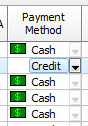

# Showing bitmaps in data cells depending on the field values

`TDBGridEh` allows to show bitmaps from `TImageList` component depending on the field values. In order to show bitmaps you need fill list `Column.KeyList` property by the possible field values (every value in the separated line) and set `Column.ImageList` property by the `TImageList` control that has the bitmaps. Every image in `ImageList` corresponds to the string line in the `KeyList` property. You can also set `Column.NotInKeyListIndex` property to the index of bitmap that will be shown if the field's value does not correspond to any value in the `KeyList` (for instance you can set index of image for `Null` field value). At run time you can’t edit cells with bitmaps. Use `SPACE` key or mouse click to set value from next line of `Column.KeyList` to the field. Use `Shift+SPACE` key or `Shift+Mouse` click to set value from previous line `Column.KeyList`. You can also set `Column.DblClickNextval` to `True` to allow changing values in cell by double mouse clicking. 

Use `Column.ShowImageAndText` property to allow display text and picture in the cell. When `Column.ShowImageAndText = False` and `Column.ImageList` is assigned then grid will draw only picture from `ImageList`.
If the next properties are filled: `Column.ImageList`, `Column.KeyList` `Column.PickList` and `Column`.`ShowImageAndText = True`, then each column cell will work as combobox `KeyList` type and a each entry cell will show a picture of the `ImageList`.
Use the event `TColumnEh.OnGetCellParams` to specify a particular image index for pictures from `ImageList`. In the event handler, set `Params.ImageIndex` parameter value depending on the values of the fields of the current record, or other conditions.
