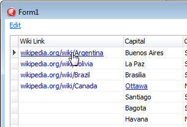

# The text in a cell as a link

Use the property `TColumnEh.CellDataIsLink` of `DBGridEh.TColumnEh` and `DBVertGridEh.TFieldRowEh` classes to customize the text or a picture in a grid cell in such a way that it looks like a URL link.

When you point the mouse to the text the cursor icon changes the view of the cursor to the type of "index finger" and draws the text in a cell type in "Underline" style.

When you click on the link the `TAxisBarEh.OnCellDataLinkClick` event occurs.

It is possible to define a link state for each DataSet record.

To do this, write an event handler for `TAxisBarEh.OnGetCellParams` event and set `Params.TextIsLink` or `Params.ImageIsLink`.

`True` value in the `TextIsLink` property of `Params` argument specifies that the text in the cell have to be appeared and respond to the mouse as a reference.

`True` value in the `ImageIsLink` property of `Params` argument specifies that the image from `TColumnEh.ImageList` in the cell have to be appeared and respond to the mouse as a reference.

See a demo project in the folder `<EhLib Archive>/DEMOS/CellDataIsLink`.