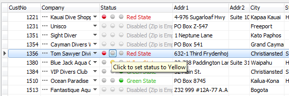
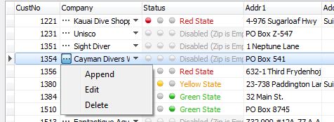
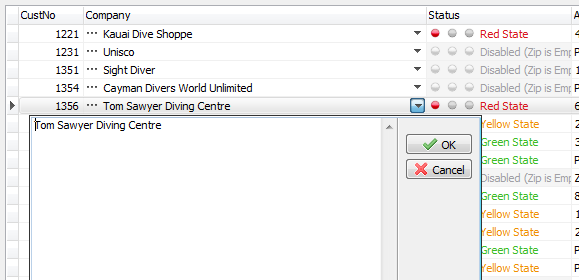
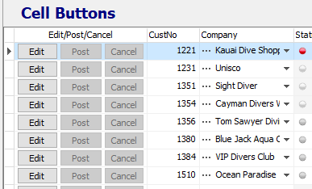

# Edit button at the cell level. CellButtons collection


In the columns of the grid - `TColumnEh` and vertical grid rows - `TFieldRow` there is a collection of buttons - `CellButtons`.
The collection contains `TCellButtonEh` type elements. `CellButton` element specifies the button in the grid cell. `CellButton` element is similar to `EditButton` element (edit button), but unlike the EditButton is pressed without opening a text editor. Set of `TCellButtonEh` properties are similar to a list of properties in `TEditButtonEh` and have additional properties.








It is also possible to display button face in the cells content area.
To do this, set the `CellButton.HorzPlacement` property to `ebhpInContentEh`.

In the following screenshot, the first column displays three `CellButtons` with the `CellButton.HorzPlacement = ebhpInContentEh` property set. Using the `CellButton.OnGetEnabledState` event, properties are set to deactivate buttons depending on the editing status of the current record.




`TCellButtonEh` has next additional properties and events:

##### Properties:

```pascal:no-line-numbers
property HorzPlacement: TEditButtonHorzPlacementEh default ebhpRightEh;
```
<dd>

It specifies the location of the buttons in the grid cell horizontally.
`TEditButtonHorzPlacementEh` type has the following values:

`ebhpLeftEh` - button is aligned to the left edge of the cell.

`ebhpRightEh` - button is aligned to the right edge of the cell.

`ebhpInContentEh` - The button is displayed in the content area of the cell. In this case, the cell content specified by the TColumnEh.FieldName property is not displayed.

</dd><br>

```pascal:no-line-numbers
property AutoFade: Boolean
```
<dd>

Make the button image faded when the mouse cursor is not over the button. The default is `True`.

</dd><br>

```pascal:no-line-numbers
property Caption: String
```
<dd>

The content of the button as text. If this property is set, then the button icon specified by the `Style` property is not used.

</dd><br>

```pascal:no-line-numbers
property Margins: TPaddings
```
<dd>
Padding from the edges of the button.
</dd><br>

##### Events:

```pascal:no-line-numbers
property OnGetEnabledState: TCellButtonGetEnabledStateEventEh;

type  
  TCellButtonGetEnabledStateEventEh = procedure(Grid: TCustomDBAxisGridEh; 
  AxisBar: TAxisBarEh; CellButton: TCellButtonEh; 
  var ButtonEnabled: Boolean) of object;
```

<dd>

The event is called for every record in the grid. You can set `ButtonEnabled` property to set that particular record button is not available for the press. In this case, it will be drawn in the `Disabled` styles.

</dd><br>

```pascal:no-line-numbers
property OnDraw: TDrawCellButtonEventEh;

  type  TDrawCellButtonEventEh = procedure(Grid: TCustomDBAxisGridEh; 
    AxisBar: TAxisBarEh; CellButton: TCellButtonEh; Canvas: TCanvas; 
    Cell, AreaCell: TGridCoord; const ARect: TRect; 
    ButtonDrawParams: TCellButtonDrawParamsEh; var Handled: Boolean) of object;
```


<dd>

The event is called when rendering the button in a grid cell. In the event you can specify the parameters of the rendering by assigning the appropriate properties in `ButtonDrawParams` parameter, or you yourself can draw the image button, or you can call the default method of rendering - `CellButton`.`DefaultDrawEditButton`. In the second and third case, set the `Handled` parameter to True to prevent the grid drawing the cell after the event.

</dd><br>

```pascal:no-line-numbers
property OnMouseClick: TMouseCellButtonEventEh;
```
<dd>
This event is fired when pressing the mouse button.
</dd><br>

```pascal:no-line-numbers
property OnMouseDown: TMouseCellButtonEventEh;
```

<dd>

Event is fired when the button is clicked with the mouse.

</dd><br>

See example of using CellButtons in the Project:
 
`Demos\DBGridEh.CellButtons\Project1.dpr`
