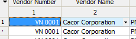
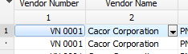

# Fonts and coloring of the data grid

### Working with the Grid Fonts 
Use `TDBGridEh.Font` property to set the font for the entire grid. Changing the properties of `TDBGridEh`.Font will affect all cells of the grid that use the font "Default" or "Not stored". For example, if you change the font in the column grid - `TColumnEh.Font`, font properties are locked at the column level, and it will always use the font `TColumnEh.Font` no matter how the `TDBGridEh.Font`. To return the column to the state when they are using the font `TDBGridEh.Font` it must be removed from the property value `cvFont` `TColumnEh.AssignedValues`. Each element of the grid, which have the Font property, has the additional property to set the state "use the default font" This property has a name a `AssignedValues` or `ParentFont`. For example, to work with the font header columns use properties `TitleParams.Font` of `TFont` type and `TitleParams.ParentFont` of `Boolean` type.

### The background color of the cells in the grid
To set the background grid use the `TDBGridEh.Color` and `TDBGridEh.FixedColor` properties. 
`TDBGridEh.Color` property is responsible for the background color in the cells of data and the areas not shaded cells. `TDBGridEh.FixedColor` property is responsible for the color of the fixed cells. Changing of the `TDBGridEh.Color` property will affect the entire grid cell that uses the background color of the "default" or "Not stored" state. For example, if you change the color in the column grid `TColumnEh.Color`, the color will be fixed at the column level, and it will always use the `TColumnEh.Color` regardless of how the property `TDBGridEh.Color` is changed. To return the column to the state when they use color `TDBGridEh.Color` the `cvColor` value must be removed `TColumnEh.AssignedValues` property. Each element of the grid which have a of `Color` property, also has the additional property to set the "use color by default." This property has a `AssignedValues` or `ParentColor` name.

### Font and background data cells
To customize the font and background colors of cells with data using the following properties:
`Columns[i].Font`, `Columns[i].Color` – to set the font and background colors for a particular column
`EvenRowColor`, `OddRowColor` – to set the color even and odd entries in the grid. To work correctly, the `DataSet` must correctly return the record number through the property `DataSet.RecNo`.

### 3D и flat grid style. 
Use the property `TDBGridEh.OptionsEh` to display / hide the frame around the 3D-fixed, fixed, footers and rows of data.
Use `TDBGridEh.Flat` property to display the grid in the "flat-style".

### Style display of the selected cell and the selection

By default, the grid automatically adjusts the style of shading selected cell and fixed-grid areas, depending on the color scheme Windows and project settings in IDE Project `Options-> Application-> Runtime thems`.

In Classic mode, the cell is painted with a solid color

Themed mode uses a grid class objects `Vcl.Themes.StyleServices` to fill cells in a certain style.	 

You can set the style of the selected cell staining for each individual using the `SelectionDrawParams`.`SelectionStyle` and `SelectionDrawParams.DrawFocusFrame` property.
You can also set the style of the selected cell globally for all project Grids. To do this, use the properties of the global object and `GridsEh.GridDefaultDrawStyleEh.SelectionStyle` GridsEh.`GridDefaultDrawStyleEh.DrawFocusFrame`.

### Selecting and highlighting the current record

To activate, when the grid is always select the whole record, set `dgRowSelect` value in the `Options` property.
To illuminate the current record in the grid, set `dghRowHighlight` value in the `OptionsEh` property.
