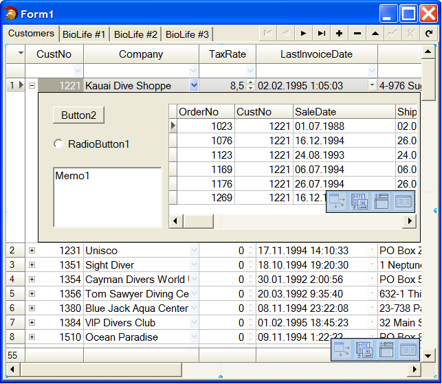

# Panel of detail information for record – RowDetailPanel

Subproperties of `RowDetailPanel` property allow you to create and customize the panel of detailed information for grid rows. Panel if detailed information is a special area inside grid where you can put any control from `Component Palette` on it. At design-time a panel is always opened under the current record. At run-time panel is hidden, and there is a `+` sign at the beginning part of every row. You can click `+` sign to open panel. At once time panel can be opened only for one row. You can also open panel using key combination `Ctrl-Down` or key `+`. Use `Ctrl-Up` to return from panel to grid row. Use `*` key to show or hide panel depending on current state.

Subproperties of `RowDatailPanel` propery:

 `Active: Boolean` 	this propery allows activating panel of detailed information.

 `Width: Integer`   	width of panel

 `Height: Integer`   	height of panel

 `ActiveControl: TWinControl` use this property to define control which will be focused when panel is opening.

 `BevelEdges: TBevelEdges` 
 `BevelInner: TBevelCut` 
 `BevelOuter: TBevelCut` 
 `BevelKind: TBevelKind` 
 `BevelWidth: TBevelWidth` 
 `BorderStyle: TBorderStyle`: 	
 
 <dd>Use these properties to control border style of panel.</dd>

 `Color: TColor`			Color of panel
 
 `ParentColor: Boolean`	Property defines if it is need to use color of grid as a color of panel.  

**Public properties:**

`Visible: Boolean`		This property defines if panel is visible. You can set this property at run-time for reading and writing.

Use event `OnCheckRowHaveDetailPanel` to control of panel showing in grid. You can set parameter `RowHaveDetailPanel` to allow or forbid panel for required record.

Use events `OnRowDetailPanelHide` and `OnRowDetailPanelShow` to execute special action after panel is hidden or before panel is opened. 

