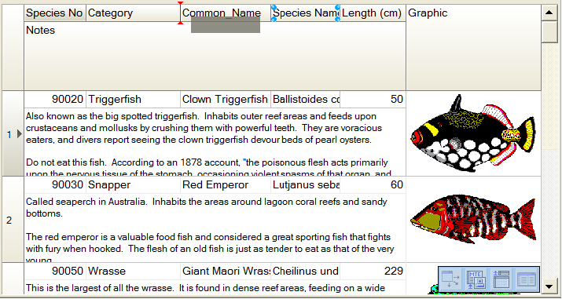

# RowPanel mode

Grid can work in special mode when every cell of grid can be placed under each other and can have individual height. Set `RowPanel.Active` to `True` value to activate this mode. At design-time you can place cell, vertical and horizontal size. At run-time the possibility to change position of cell depends on the presence `dghColumnMove` value in `OptionsEh` property. Possibility to change vertical size of cell depends on `RowSizingAllowed` property.

When user change cell width, the grid also changes width of adjoined cells which are placed under or above of changing cell and if the right border of these cells match. By analogy when user changes cell height, grid changes height of cells in left or right part of grid if low borders march. Press and hold `Shift` key to change the size of only single cell.

To change cell height of cell you need to move mouse cursor to the low border of the title cell. Mouse cursor will change its image from arrow to two arrows with up and down direction. At this moment press right mouse button and change size.
To change position of cell you need to press right mouse button on the title cell and drag it to the required place.

Additional subproperies of the `RowPanel` property:

 `NavKeysNavigationType: TGridRowPanelNavKeysNavigationTypeEh` defines the order of navigation over cells in the grid when keys `Up`, `Down`, `Left`, `Right` are pressed.
 <sh>

 `rpntRowToRowEh` - (by default) Keys Up, Down move current cell to next or previous record of dataset. Keys Left, Right works as Tab and Shift-Tab.

 `rpntCellToCellEh` -	Keys Up, Down move current cell to under or above last position from the current cell. Keys Left, Right move current cell to left or right position from the current cell.
</sh>
 
 `TabNavigationType: TGridRowPanelTabNavigationTypeEh` defines an order of going through cells of the grid by Tab key

 <sh>

`rpntUpToDownPriorityEh` Go, at first, from top to bottom, than from left to right.

`rpntLeftToRightPriorityEh` Go, at first, from left to right, than from top to bottom.

</sh>

In the current implementation, the `RowPanel` mode is not compatible with the `MultiTitle` header mode.
If `RowPanel` is enabled, then `MultiTitle` headers are disabled automatically.
