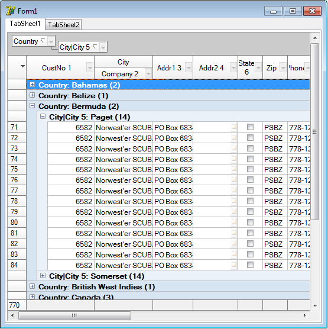
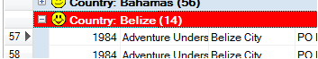
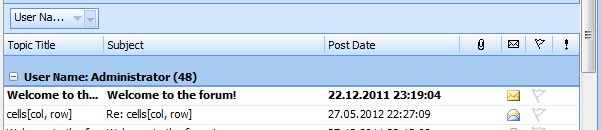
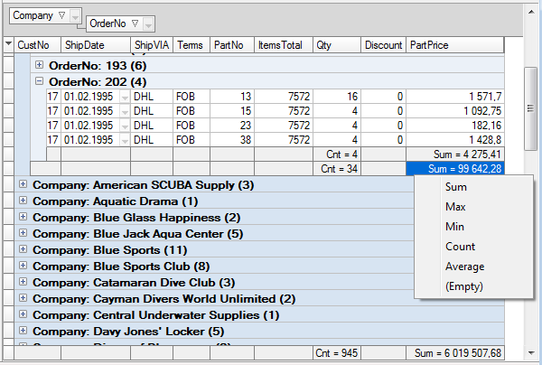
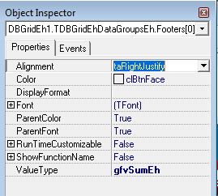

# Working with data grouping mode


Grid allows to group data in memory using columns as a grouping criterions. 
You can create and change grouping at design-time and at run-time.
The grouping works only when grid is connected to dataset of TMemTableEh type.




When grid group data it also sort data in `MemTableEh` to have correspondence of data in the grid and in the `MemTable`. The Grid track data in the MemTable and moves records in corresponding groups when data are changed. Use subproperties of `Grid.DataGrouping` property to control grouping. Use `Grid.DataGrouping.GroupLevels` property to create structure of grouping. `GroupLevels` is a collection of `TDBGridEhDataGroupLevelEh`. Every item of collection corresponds one level of grouping. The key property of the item of collection is the `ColumnName` property of  `String` type. This property keeps name of the column of field for which the records will be group. Use `TColumnEh.Name` property to get the name of the column at run-time. 
Use `Font` and `Color` properties of structures items to control the format of the grouping records. Set `Grid.DataGrouping.Active` to True to activate the grouping. Set `GroupPanelVisible` property to True to show the current active structure of the grouping. Special panel will be shown with active items of grouping at the top part of the gird. The element of the grouping collection is active when its `ColumnName` property holds a name of a column. After activation of grouping panel, you can make and change the grouping structure using drag-n-drop operations. Drag the column title to the grouping panel to group data by this column. In time of forming the tree of grouping, grid creates the new group record when the value of the field of column Column.Field is changed. You can change key value of grouping in the event `TDBGridEhDataGroupLevelEh.OnGetKeyValue` or `TColumnsEh.OnGroupGetKeyValue`. Take current value of the key value from the field `GroupLevel.Column.Field.Value`. Write the changed value to the `KeyValue` parameter of the event procedure. 

For example, next event will form tree of grouping that will have only two grouping records `Big` and `Small` for numeric field that have record values that bigger or smaller them 100. 

```pascal:no-line-numbers
procedure TForm1.gridFishColumns6GroupGetKeyValue(Sender: TCustomDBGridEh;
  Column: TColumnEh; var KeyValue: Variant);
begin
  if Column.Field.AsFloat > 100 then
    KeyValue := 'Big'
  else
    KeyValue := 'Small';
end;
```

Grid uses key value to form string that will be shown in the grouping row. If you changed key value of the grouping, then you likely need to change algorithm that convert key value to display value for display. Write OnGetKeyValueAsText event to do it. Write Grid.OnDataGroupGetRowText and GroupLevels.OnGetGroupRowText to rewrite the algorithm of forming the text that is shown in the grouping row.

Use property Grid.DataGrouping.GroupDataTree to access the items of grouping tree. The property have the TGridGroupDataTreeEh type and is inherited form TTreeListEh. The items of TTreeListEh class form the tree-type structure of groups and references to DataSet records for the lowest levels of grouping. Use properties FlatVisibleCount and FlatVisibleItem[Index] to access items as a flat list. The flat list FlatVisibleItem contain only items which are in the scope of the expanded nodes. Amount of items in flat array corresponds  amount of rows in the grid. Every item of array is a reference to the instance of TGroupDataTreeNodeEh class and defines a node in the grouping tree. Basic properties of this class are:

`Count: Integer`
<sh>
Amount of nodes in the group. Nodes can be over groups of lower level or references to dataset records.
</sh>

`DataGroup: TGridDataGroupLevelEh`
<dl><sh>
Reference to item of grouping structure. Not empty if the node is a node of group.
</sh></dl>

`DataSetRecordViewNo: Integer`
<dl><sh>
Number of record in MemTableEh. Not empty if the node is a node of the dataset record.
</sh></dl>

`Expanded: Boolean`
<dl><sh>
Node is expanded.
</sh></dl>

`Items[Index: Integer]: TGroupDataTreeNodeEh`
<dl><sh>
List of nodes of the lower level.
</sh></dl>

`KeyValue: Variant`
<dl><sh>
KeyValue
</sh></dl>

`Level: Integer`
<dl><sh>
The number of node level;
</sh></dl>

`NodeType: TGroupDataTreeNodeTypeEh`
<dl><sh>
Type of the node. The Node of a group level or a record level.
</sh></dl>

`Parent`
<dl><sh>
A pointer to the parent branch.
</sh></dl>
<br>

Use Items property of `Grid.DataGrouping.GroupDataTree` to access the grouping tree as a tree-type structure. Every item of this list is a reference to a tree node of grouping of highest level.

`TDBGridEh.DataGrouping` property has next subproperties:

`Active: Boolean`
Set this property to active grouping in the grid.

`DefaultStateExpanded: Boolean`
Define Expanded state for every new group node.

`GroupLevels: TGridDataGroupLevelsEh`
Collection of the grouping structure.  Use this property to define template of grouping.

`GroupPanelVisible: Boolean`
Set this property to True to show panel of grouping in the top part of the grid. When the panel is visible you can form the structure of grouping by dragging the title of the column onto this panel.

`Font: TFont`
Defines default Font of grouping records.

`Color: TColor`
Defines default Color of grouping records.
<br>

Write `Grid.OnActiveGroupingStructChanged` to take action when the structure of grouping is changed.

Grid calls `OnDataGroupGetRowParams` before drawing of a group record. 
In the event you can change `Text`, `Color`, `Font` and add Image from `ImageList` on the left of the text.
When the event is calling the `DataSet` is positioned on the first record in the group. So you can access field values of `Dataset` inside the event.



The event has next type and declaration:

```pascal:no-line-numbers
TDBGridEhDataGroupGetGroupRowParamsEvent = procedure (
  Sender: TCustomDBGridEh; 
  GroupDataTreeNode: TGroupDataTreeNodeEh; 
  Params: TGroupRowParamsEh) of object; 
```

`Params` is of `TGroupRowParamsEh` type and has next properties:
 <dl><sh>

`property Color: TColor` 	 
<dl><sh>Color of the cell background</sh></dl>

`property Font: TFont` 	 
<dl><sh>Font of the text</sh></dl>

`property Images: TCustomImageList` 
<dl><sh>ImageList to show images</sh></dl>

`property ImageIndex: Integer` 	 
<dl><sh>Index of a image from the ImageList.</sh></dl>

`property GroupRowText: String` 	
<dl><sh>Text to show in the cell of the group</sh></dl>

`property State: TGridDrawState` 	 
<dl><sh>Readonly property. Draw state.</sh></dl>

</sh></dl>
<br>

`DBGridEh` allows you to customize headers groups including the following string parameters: height, font and color of the grouping records, and the thickness and color of a horizontal dividing line.
 



Sub-properties of property `TDBGridEh.DataGrouping`:

`Active: Boolean`
<dl><sh>Specifies that the group mode is enabled. (Group only works when connected to the Grid DataSet type TMemTableEh).</sh></dl>

`Color: TColor`
<dl><sh>The background color of the flash.</sh></dl>

`Font: TFont`
<dl><sh>Font group records.</sh></dl>

`GroupLevels: TGridDataGroupLevelsEh`
<dl><sh>Collection group  levels. Key groups is the name of the column level that is used to group the value.</sh></dl>

`Footers: TGridDataGroupFootersEh`
<dl><sh>A collection of items to display summarizing values in groups and in general on the grid.</sh></dl>

`FootersDefValues: TGridDataGroupFootersDefValuesEh`
<dl><sh>The default values for the summation of records.</sh></dl>

`GroupPanelVisible: Boolean`
<dl><sh>Property indicates that the panel group at the top of the grid is visible. The panel displays the current grouping levels. In Run-Time and Design-Time, you can drag the panel column headers to add to the group</sh></dl>

`ParentColor: Boolean`
<dl><sh>Use color for color Grid of group’s records.</sh></dl>

`ParentFont: Boolean`
<dl><sh>Use Font Grid to display the text of the group.</sh></dl>

`DefaultStateExpanded: Boolean`
<dl><sh>Defines the opening or closing of the State group by default when building groups</sh></dl>

`GroupRowDefValues: TGridDataGroupRowDefValuesEh`
<dl><sh>Default values for the grouping of records.</sh></dl>

`ShiftFolldataGroupRow: Boolean`
<dl><sh>Property specifies whether you want to move the Group recording the lowest level to the left of the data records.</sh></dl>
		
### Displaying summing records in groups.
In the group is allowed to display a grid summarizing the records for each group, and the overall record summarizing the bottom of the grid.
 


Use a collection `TDBGridEh.DataGrouping.Footers` to create entries accumulating information (footer). Each item in the collection is one entry footer. One record footers will appear in several places in the grid. First, the record shows the footer at the bottom of the grid and displays aggregated values across the DataSet. Second, the record shows the footer of each group. The first entry footer can be displayed in the header record of the group. The first record for the state of the property is responsible footer `DataGrouping`.`GroupRowDefValues.FooterInGroupRow`. When `FooterInGroupRow = True` `Footers` first item in the collection is displayed in the header record of the group.




Each item in the collection `TDBGridEh.DataGrouping.Footers` in turn, is a collection of items `ReadOnly` footer corresponding to each of the columns of the grid. When you create a new collection Footer, `Footers` system automatically populates a collection of Footer and the number of columns in the grid. After creating a new Footer you must select the item if you want to specify a footer, and an aggregate function to count. The function type is defined in the `Footer.ColumnItems[i].ValueType.ShowFunctionName` property determines whether to display the values to the left of the short name aggregation functions. `RunTimeCustomizable` property determines what type of function can be changed at `RunTime` on the right mouse button over a cell’s footer.

`Grid.DataGroupoing.Footers[i]: TGridDataGroupFooterEh`

`Color: TColor`
<dl><sh>
Specifies the background color for the footer color.
</sh></dl>

`Font: TFont`
<dl><sh>
Controls the font in which the title cells displays its data.
</sh></dl>

`Visible: Boolean`
<dl><sh>
Specifies  whether the footer is visible in the grid.
</sh></dl>

`ColumnItems: TGridDataGroupFooterColumnItemsEh`
<dl><sh>
Colleaction of Items for every columns. Items in the collection are created automatically based on the list of columns.
</sh></dl>

`ParentColor: Boolean`
<dl><sh>
Determines where a control looks for its color information.
</sh></dl>

`ParentFont: Boolean`
<dl><sh>
Determines where a control looks for its font information.
</sh></dl>

`ShowFunctionName: Boolean`
<dl><sh>
Specifies whether to show the name of the integrable function in a cell footer.
</sh></dl>

`RunTimeCustomizable: Boolean`
<dl><sh>
Specifies that a user can change summing function at Run-Time by mouse left button click.
</sh></dl>
 
Grid.DataGrouping.Footers[i].ColumnItems[j]: TGridDataGroupFooterColumnItemEh

`Alignment: TAlignment`
<dl><sh>
Specifies how text is aligned within the footer cell.
</sh></dl>

`Color: TColor`
<dl><sh>
Specifies the background color for the footer color.
</sh></dl>

`DisplayFormat: string`
<dl><sh>
Determines how numeric and time values are formatted for display in a footer cell.
</sh></dl>

`Font: TFont`
<dl><sh>
Controls the font in which the title cells displays its data.
</sh></dl>

`ParentColor: Boolean`
<dl><sh>
Determines where a control looks for its color information.
</sh></dl>

`ParentFont: Boolean`
<dl><sh>
Determines where a control looks for its font information.
</sh></dl>

`ValueType: TGroupFooterValueTypeEh`
<dl><sh>
Summation function.
</sh></dl>

`ShowFunctionName: Boolean`
<dl><sh>
Specifies whether to show the name of the integrable function in a cell footer.
</sh></dl>

`RunTimeCustomizable: Boolean`
<dl><sh>
Specifies that a user can change summing function at Run-Time by mouse left button click.
</sh></dl>

### The use of non-standard algorithms to calculate the aggregated values.
In the group the data grid allows to calculate the value of the elements in the footer of the event. This allows for aggregation functions of any complexity. For each entry `DataSet` called `OnDataGroupFooterAggregateValue` event in which to calculate the current value of the aggregate value of the event is given for each DataSet entry. For example, the function sum must be added the current field value to the counter sum

```pascal:no-line-numbers
procedure TfrMailBox.DBGridEh1Columns5DataGroupFooterAggregateValue (
  Grid: TCustomDBGridEh; Column: TColumnEh;
  GroupFooter: TGridDataGroupFooterEh;
FooterColumnItem: TGridDataGroupFooterColumnItemEh; var AValue: Variant;
Node: TGroupDataTreeNodeEh; var Processed: Boolean);
begin
  if VarIsEmpty (AValue) then
begin
    AValue: = VarArrayCreate ([0,1], varInteger);
    AValue [0]: = 0;
    AValue [1]: = 0;
end; 
  if MemTableEh1post_read.AsInteger = 1
    then AValue [0]: = AValue [0] + 1
    else AValue [1]: = AValue [1] + 1;
  Processed: = True;
end; 
```
 
After all calls `OnDataGroupFooterAggregateValue` events for each record dataset process causes the event the aggregate value of final settlement - `ColumnEh.OnDataGroupFooterFinalizeValue`. If implemented feature requires a final step to calculate a value, it can be done in this event. 
For example, to calculate the average value of the function at the final step of the calculation necessary to cut the sum of the number of records.

SumValue / RecordsCount

To implement this functionality, you need to calculate the variable to store two values: the sum of the number of records.For this purpose, the calculation of the variable AValue: Variant can make an array of two values, and in the function of the final payment, divide the first element of the array (sum) to the second element (number).

SumValue / RecordsCount

To implement this functionality, you need to calculate the variable to store two values: the sum of the number of records.For this purpose, the calculation of the variable `AValue: Variant` can make an array of two values, and in the function of the final payment, divide the first element of the array (sum) to the second element (number).
When the value of a cell footer display is converted a value to a text representation of `OnDataGroupFooterToDisplayText`.
Events `OnDataGroupFooterAggregateValue`, `OnDataGroupFooterFinalizeValue` `OnDataGroupFooterToDisplayText` and declared in the class and `TDBGridEh` `TColumnEh`.

**Event descriptions:**

`OnDataGroupFooterAggregateValue` event
The event is alled for each record dataset. In the event it is necessary to perform the next step of the aggregation functions.   

<dl><sh>

`Grid: TCustomDBGridEh`
Grid for which to calculate the aggregated value.

`Column: TColumnEh`
The column for which to calculate the aggregated value.

`GroupFooter: TGridDataGroupFooterEh`
Footer for which to calculate the aggregated value.

`FooterColumnItem: TGridDataGroup FooterColumnItemEh`
The element footer column for which the aggregated value is calculated.

`var AValue	Variant`
The current value of the summation.

`Node: TGroupDataTreeNodeEh`
Tree item grouping.

`var Processed: Boolean`
Set Processed to True, if you have completed step sum in the event. Otherwise, the step of summing function is handled by default.
</sh></dl>

`OnDataGroupFooterFinalizeValue` event
Called after all calls OnDataGroup FooterAggregateValue. In the event it is necessary to perform the final calculation of aggregate functions.

<dl><sh>

`Grid: TCustomDBGridEh`

`Column: TColumnEh`

`GroupFooter: TGridDataGroup FooterEh`

`FooterColumnItem: TGridDataGroup FooterColumnItemEh`

`var AValue: Variant`

`var Processed: Boolean`
</sh></dl>

`OnDataGroupFooterToDisplayText` event
It is called each time when footer cell is drawen. Write this event to transform the internal aggregated values to a display text value.
<dl><sh>

`Grid: TCustomDBGridEh`

`Column: TColumnEh`

`GroupFooter: TGridDataGroupFooterEh`

`FooterColumnItem: TGridDataGroupFooterColumnItemEh`

`var AValue: Variant`

`var DisplayValue: String`

`var Processed: Boolean`
</sh></dl>

		 
Using technology of summation in groups to summarize data where grouping is not necessary.
In the grid, there are two technologies of summarizing data.
1. Summation via SumList using subproperties TDBGridEh.SumList and setup functions through summation TColumnEh.Footer.
2. Summation via the functional grouping records when TDBGridEh.DataGrouping.Actitve = True.
These two features are independent of each other. Configure one functionality does not affect the other. However it is recommended to use only one feature at a time.
Summation over SumList works for any type of DataSet, while grouping records only works when plugged into the grid TMemTableEh. But adding a SumList there is a drawback concerning data types. SumList technology keeps the total values in the variables of type Currency. The maximum number of digits after the decimal point for the summation of values = 4.
Summation by grouping records using generic type Variant, and also allows the use of non-standard algorithms for aggregation through events. 
Summation by grouping records also allows to sum without having to create groups. To make the sum with no groups, activate the group - DataGrouping.Active = True, the elements of the collection to create footers - DataGrouping.Footers, but do not enable the panel grouping DataGrouping.GroupPanelVisible = False. In this case, for each of the items in the collection will be displayed one footer at the bottom of the grid entry. 
