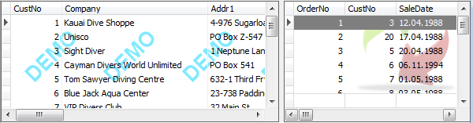

# Display graphic in grid background

`DBGridEh` lets you display a static image (type `TPicture`) in the background of the client area of the grid.

To customize the display graphic background use BackgroundData properties `DBGridEh.BackgroundData`.
`DBGridEh.BackgroundData: TDBGridBackgroundDataEh`

`Visible: Boolean`
<sh>Specifies whether the Background Pciture is visible in the grid.</sh>

`Picture: TPicture`
<sh>The Pciture to draw as a Background Data.</sh>

`Placement: TImagePlacementEh`

`ImagePlacementEh = (ipTopLeftEh, ipTopCenterEh, ipTopRightEh, ipCenterLeftEh, ipCenterCenterEh, ipCenterRightEh, ipBottomLeftEh, ipBottomCenterEh, ipBottomRightEh, ipFillEh, ipFitEh, ipStretchEh, ipTileEh);`
<sh>Specifies the position of the image and the way of filling the free space</sh>

`HorzMargin: Integer`
<sh>Horizontal Shift</sh>

`VertMargin: Integer`
<sh>Vertical Shift</sh>

`ExcludeTitle: Boolean`
<sh>Delete the title of the fill graphic background.</sh>

`ExcludeIndicator: Boolean`
<sh>Delete button from the fill graphic background.</sh>

`ExcludeFooter: Boolean`
<sh>Delete the footer of the fill graphic background.</sh>

 