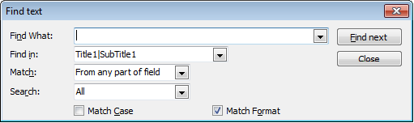

# Searching Data in the Grid

DBGridEh allows you to perform the following types of search data:

### Dialog search – With the help of a special window Dialogue.




To allow interactive search grid, set `dghDialogFind` value In `TDBGridEh.OptionsEh` property. At Run-Time Use the `Ctrl+F` key combination to show the search dialog.
To run the program from the dialog box, use the procedure from  DBGridEhFindDlgs module.

```pascal:no-line-numbers
procedure ExecuteDBGridEhFindDialog(Grid: TCustomDBGridEh; 
  Text, FieldName: String; ColumnFields: TColumnFieldsArrEh;  
  Modal: Boolean);
```
You can override the global method of assigning a dialog box pointer to the global process 

```pascal:no-line-numbers
var
  ExecuteDBGridEhFindDialogProc: TExecuteDBGridEhFindDialogProc;
```
You can redefine the key combination to display the dialog box by assigning a new combination of a global variable `DBGridEhFindDialogKey: TShortCut`. The variable declared in the module `DBGridEh`.

### Incremental search in the column – Search while typing in the column grid.

`TDBGridEh` allows users to make a special "incremental" searches column grid. When the user enters an incremental search, he can type characters. This grid will tries to find typed text in the current column. Use `dghIncSearch` and `dghPreferIncSearch` values (property OptionsEh) for controlling an incremental search. At runtime, you can use the following keyboard shortcuts for incremental search:

`Ctrl+F` - start incremental search.

`Ctrl+Enter` - Find next match.

`Ctrl+Shift+Enter` - Find previous match.

If dghIncSearch included OptionsEh and column - read-only, then the grid includes an incremental search automatically the first time the key is pressed and will be returned to normal after 1.5 seconds. dghPreferIncSearch value determines that the grid will set increment search mode automatically when the first key is pressed instead of editing.

To use the incremental search in the code use the following methods:

```pascal:no-line-numbers
procedure TCustomDBGridEh.StartInplaceSearch(const ss: String; TimeOut: Integer; 
  InpsDirection: TLocateTextDirectionEh);
```
Starts Incremental search and searches for the string passed. Ss parameter contains the search string. TimeOut parameter contains the period in milliseconds after which an incremental search is automatically stopped. InpsDirection parameter specifies the search direction.

```pascal:no-line-numbers
procedure TCustomDBGridEh.StopInplaceSearch;
```
The method stops incremental search mode.

### Search through the search panel

Search using a special panel contain text editor where user type the text to search for. Read the detail in the next section.
