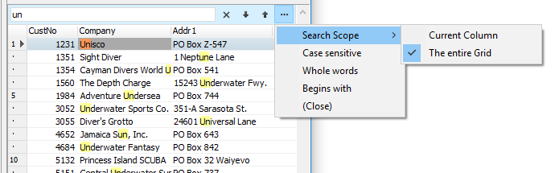
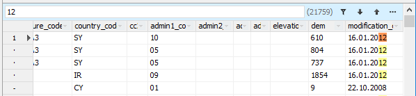

# Search panel and filter data (SearchPanel)

`DBGridEh` can display a special panel to search and filter data in the grid.
 

In search mode, grid displays the search phrase in all grid cells in a different color (yellow by default).Grid also allows you to filter the data so that the screen will display only those records that include the search string.
There is ellipses button "..." in the `TDBGridEh.SearchPanel`. Click on the button opens a drop down menu where you can choose the following search options in the grid:
- Search area: The current column or the entire grid.
- Search with or without text case.
- Search complete words or parts of words.
If the found text is hidden behind the border of the cell, the number of hidden found matches is displayed in a yellow box at the top right side of the cell.

If the grid is connected to a `DataSet` of the type `TMemTableEh`, automatic search of the detected cells is performed automatically through the `SearchPanel`.
The value found is displayed to the right of the search string.
While the calculation is in progress, the intermediate quantity found is displayed in parentheses.
The final amount found is displayed without parentheses.

To configure the settings panel, search and filter properties using sub-properties `DBGridEh.SearchPanel`.

Sub-properties properties `TDBGridEh.SearchPanel`:

`property Enabled: Boolean`
<dl><sh>

Set the `Enabled` property to `True` to activate the search and filter of the panel. Activate the `Panel` still does not mean that it will be immediately visible in the grid. Panel's visibility is set through property `PersistentShowing`.
</sh></dl>

`property PersistentShowing: Boolean`
<dl><sh>

Specifies that the search panel always visible in the grid. If `PersistentShowing = False`, the panel becomes visible after pressing the key combination to activate the search through the panel in the property ShortCut.
</sh></dl>

`property ShortCut: TShortCut`
<dl><sh>

Specifies the key combination to activate the search panel and give focus to the input text editor search bar. Defaults to `Ctrl + F`.
</sh></dl>

`property Location: TSearchPanelLocationEh`
<dl><sh>

Location of the search panel. Can take the following values:
 <dl><sh>

`splGridTopEh` - Search panel at the top of the grid above the title.

`splHorzScrollBarExtraPanelEh` - Search panel is in the "extra-bar" thumb scroll horizontally. The search panel works correctly in this location, "extra-panel" slider is visible.

`splExternal` - Search panel is outside the grid. In this mode, the algorithm of the search panel and drawing the sole responsibility of the developer. 
</sh></dl>
</sh></dl>

`property FilterOnTyping: Boolean`
<dl><sh>

Specifies that the grid will filter data as you enter text in the text editor panel of the search. If `FilterOnTyping = False` then the data will be filtered only by pressing the key «Enter» or click the Apply Filter button in the search panel.
</sh></dl>

`property FilterEnabled: Boolean`
<dl><sh>

Specifies that filter is available in the search panel. If `FilterOnTyping = False`, then the search will only be available by code.
</sh></dl>

`property OptionsPopupMenuItems: TDBGridSearchPanelOptionsMenuItemsEh`
<dl><sh>

Specify a list of elements of the drop-down menu that appears on click of Search Options ("...") button in SearchPanel.
`TDBGridSearchPanelOptionsMenuItemsEh` type may comprise the following meanings 
<dl><sh>

`gsmuSearchScopesEh` – Search Area.

`gsmuCaseSensitiveEh` – Search in case-sensitive mode.

`gsmuWholeWordsEh` – Search by full word.
</sh></dl>
</sh></dl>

`property SearchScope: TDBGridSearchPanelScopeEh`
<dl><sh>

Specifies the search area that runs by default in Search Panel
The property can be one of the following values:
 gssCurrentColumnEh – Search in the current column.
 gssEntireGridEh – Search in the entire grid.
</sh></dl>

`property CaseSensitive: Boolean`
<dl><sh>

Specify a case sensitivity of searching.
</sh></dl>

`property WholeWords: Boolean`
<dl><sh>

Specifies that the search in the SearchPanel must be performed in full word mode.
</sh></dl>

`property CellBeginsWithMode: Boolean`
<dl><sh>

Specifies that the search result must match from the start of cell.
</sh></dl>
 

SearchPanel have a set of event to control typing of text, searching a text in DBGridEh and highlighting a text in the grid cells. 
`TDBGridEh.SearchPanel` class events:	

`property OnSearchEditKeyDown`
<dl><sh>
The event occurs when a key is down in a text editor of SearchPanel.
</sh></dl>

`property OnSearchEditKeyPress`
<dl><sh>
The event occurs when a key is pressed in a text editor of SearchPanel.
</sh></dl>

`property OnSearchEditKeyUp`
<dl><sh>
The event occurs when a key is up in a text editor of SearchPanel.
</sh></dl>

`property OnSearchEditChange`
<dl><sh>
The event occurs when the text is changed the editor of SearchPanel.
</sh></dl>

`property OnCheckCellHitSearch`
<dl><sh>
The event occurs during the test conditions - of whether or not the specified grid cell meets search condition.
</sh></dl>

`property OnGetHighlightStrings`
<dl><sh>
This event occurs when the grid receive a list of strings that need to highlight the cells of the grid as a searching text.
</sh></dl>
 

See the example of using events to write an advanced search through the Search Panel in the Folder:
`DEMOS\DBGridEh.SearchPanel`        section `Demo3`.
 
