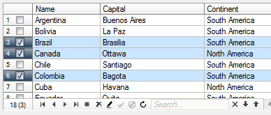
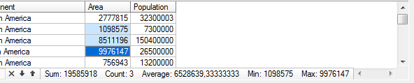

# Extra horizontal scroll bar slider (ScrollBar)

`DBGridEh` allows displaying additional information in the horizontal scrolling section. In this case, the left side of the `SrollBar` is moved to the right so as to display information.

 

Area of additional information may include the following:
•       The number of entries in the `DataSet` and the number of selected records in a grid.
•       Navigation buttons on records (`DBNavigator`).
•       Search bar and filtering (`SearchPanel`).
•      Summary information about the selected data (`MultiSelected` area). Data section will be visible when the user selects a region in the grid, square area or column. In this case, in the summary information is displayed: The amount of data, number of selected rows, average, minimum and maximum value 

 

 
Use the sub-property DBGridEh.HorzScrollBar.ExtraPanel management options to display extra panel:
<sh>

`Visible: Boolean`
Set the Visible property to True to display additional panel horizontal ScrollBar

`NavigatorButtons: TNavButtonSetEh`
Use the NavigatorButtons property to determine which navigation buttons will be visible in the database navigator.

`TNavigateBtnEh = (nbFirstEh, nbPriorEh, nbNextEh, nbLastEh, nbInsertEh, nbDeleteEh, nbEditEh, nbPostEh, nbCancelEh, nbRefreshEh);`
`TNavButtonSetEh = set of TNavigateBtnEh;`

`VisibleItems: TGridSBItemsEh`
Use VisibleItems property to determine which items will be visible in the panel.

`TGridSBItemEh = (gsbiRecordsInfoEh, gsbiNavigator, gsbiFindEditorEh, gsbiSelAggregationInfoEh);`
`TGridSBItemsEh = set of TGridSBItemEh;`
</sh>
Displaying the search for extra-panel runner is configured through the properties of the search bar Grid.SearchPanel.
Clicking on the navigation button event fires NavigatorPanelButtonClick event. The event is passed the type of button – AButton: TNavigateBtnEh. In the event handler, you can set the Processed parameter to True to avoid calling of the default handler.
