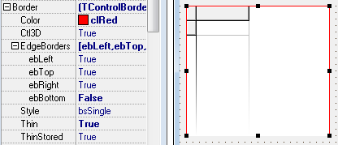

# Flexible adjustment of color and the presence of the border of the client area Grid

DBGridEh allows you to customize the color and display side border (Border) of the client area Grid.

 

Sub-properties of TDBGridEh.Border property:

`Color: Boolean`
<dl><sh>
Background color fringing.
</sh></dl>

`Ctl3D: Boolean`
<dl><sh>
Specifies that the line shall be drawn in 3D. Top and left border darker color. Bottom and right lighter.
</sh></dl>

`EdgeBorders: TEdgeBorders`
<dl><sh>
EdgeBorders property is set (set) that indicates which side of border drawn. A set can contain a combination of the following - ebLeft, ebTop, ebRight, ebBottom.
</sh></dl>

`ExtendedDraw: Boolean`
<dl><sh>

Use ExtendedDraw property to establish that border will be drawn through the inner grid instead by standard features of the functional Windows.
Color properties and EdgeBorders are taken into account only when `ExtendedDraw = True`.
</sh></dl>

`Style: TBorderStyle`
<dl><sh>
Style edging. It can take values bsNone and bsSingle.
</sh></dl>
