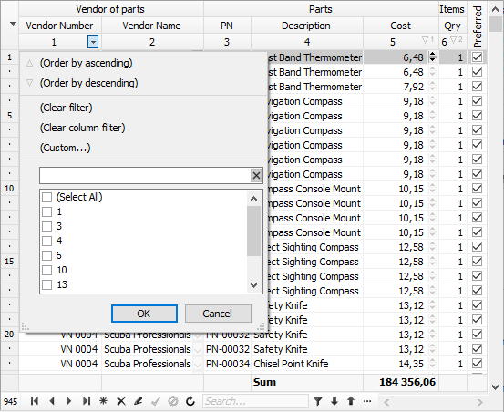
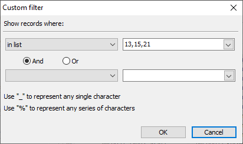

# Adjusting grid for filtering data


 `TDBGridEh` allows to show special row (under title) where user enters expressions in cells for filtering records in dataset. 
  
(Expression in the cell can look like: `"1"`, `">=1"`, `">1 AND <=5"`, `"%TestStr%"`). Set `STFilter.Visible` to `True` value to show this special row. AT Run time, when cursor locate in the filter cell, they can press `ENTER` to apply filter. Grid will parse expression in every not empty filter cell and call `TDBGridEh.ApplyFilter`. And it calls `OnApplyFilter` event or passes action to special object, if it is registered.

For normally parsing, the expression in cell have to have next format:

`[Operator1] Operand1 [)] [AND|OR Operator2 Operand2 [)] ]`

Where `OperatorX` is one of `[ = | <> | != | > | < | >= | <= | ~ | !~ | in ( ]`
`OperandX` is a numeric, date or string value or for the operator 'IN' it is a list of values divided by comma.
For instance:

`'1'`

`'>=1'`

`'>1 AND <=5'`

`'~ TestStr%'`

`'!~ TestStr_'`

`'in (1,2,3,4,5,6) and >100'`

`'in (Str1,Str2,Str3)'`

Grid allows to show dropped down list of `STFilter` in title cells. Set `STFilter.Location` to `stflInTitleFilterEh` to active this mode. Use item ‘(Custom…)’ to enter string for filtering or press checkboxes above required values. Global variable `DBGridEhShowInTitleFilterBox` contain key combination for opening list of filtering values. By default it contains `'Ctrl-T'`.



 

When grid is connected to the list of uncial values of column is formed automatically. In addition, list is formed with tacking in account of filter applied in other columns. To form list of values and command for filtering, use next events and methods: Events - `TDBGridEh.OnFillSTFilterListValues`, `TColumnEh.OnFillSTFilterListValues`, `TDBGridEhCenter.OnFillSTFilterListValues` or rewrite method `TDatasetFeaturesEh.FillSTFilterListDataValues` and  register new class `MyDatasetFeaturesEh` for interaction between grid and dataset.

Grid call event `OnFillSTFilterListValues` every time when it is needed to fill list of `StFilter`, that have next type: 

`TDBGridEhFillSTFilterListValuesEvent = procedure(Sender: TCustomDBGridEh; Column: TColumnEh; Items: TStrings; var Processed: Boolean) of object;`

This event presents in `TDBGridEh`, `TColumnEh`, `TDBGridEhCenter`.
Every item of Items list must consists of two values: String - `Items[i]` and Object `Items.Objects[i]`. Items of object type must be inherited from `TPopupListboxItemEh` type and they must be declared as global variables. There are already next global variables in DBGridEh:

`PopupListboxItemEhSortAsc: TPopupListboxItemEhSort;`

<dd>Item of the list show sorting item Asc and executes sorting in ascending order.</dd>

`PopupListboxItemEhSortDes: TPopupListboxItemEhSort;`

<dd>Item of the list show sorting item Asc and executes sorting in descending order.</dd>

`PopupListboxItemEhLine: TPopupListboxItemEhLine;`

<dd>Item of the list show horizontal line. On choosing doesn't perform any actions.</dd>

`PopupListboxItemEhClearFilter: TPopupListboxItemEhSpec;`

`PopupListboxItemEhAll: TPopupListboxItemEhSpec;`

`PopupListboxItemEhEmpties: TPopupListboxItemEhSpec;`

`PopupListboxItemEhNotEmties: TPopupListboxItemEhSpec;`

`PopupListboxItemEhDialog: TPopupListboxItemEhSpec;`

`PopupListboxItemEhApplyFilter: TPopupListboxItemEhSpec;`


`PopupListboxItemEhData: TPopupListboxItemEhData;`

Item of the list shows text that defines text of filtering. When it is selected, it is checked by checkbox and it is put in the list of items of values that is needed be in the filtered records.

You can call next methods in the event to fill values by default

`TDBGridEh.DefaultFillSTFilterListValues(Column: TColumnEh; Items: TStrings)`

`TDBGridEh.DefaultFillSTFilterListCommandValues(Column: TColumnEh; Items: TStrings)`

`TDBGridEh.DefaultFillSTFilterListDataValues (Column: TColumnEh; Items: TStrings)`


Next code show OnSTFilterListValues event where sorting items is deleted from list:

```pascal:no-line-numbers
procedure TForm1.DBGridEh1FillSTFilterListValues(Sender: TCustomDBGridEh;
  Column: TColumnEh; Items: TStrings; var Processed: Boolean);
var
  Index: Integer;
begin
  Sender.DefaultFillSTFilterListValues(Column, Items);
  Index := Items.IndexOfObject(PopupListboxItemEhSortAsc);
  if Index >= 0 then
    Items.Delete(Index);
  Index := Items.IndexOfObject(PopupListboxItemEhSortDes);
  if Index >= 0 then
    Items.Delete(Index);
  Processed := True;
end;
```

The library can fill list of unique values only for DataSet of TMemTableEh type. To fill values when grid is connected to other type of  DataSet, it is required rewrite `TDatasetFeaturesEh.FillSTFilterListDataValues` method and , if it is need, it is required to register class that inherited from `TDatasetFeaturesEh`. Read information about `TDatasetFeaturesEh` class in `EhLib users guide` and `EhLibMTE.Pas`.
      
New properties `STFilterDefaultStringOperator`, `STFilterDefaultNumberOperator`, `STFilterDefaultDateTimeOperator`, `STFilterDefaultBooleanOperator` are added in `TDBGridEhCenter` class. Use this properties to set default operator that will be used when string in the `STFilter` doesn't containt operator. The operators can be assigned apart for `String` fields, `Numeric` fields, `DateTime` fields and `logical` fields.

