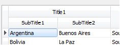
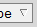
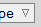
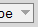
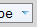
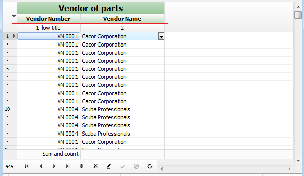

# Customizing grid title


Use the sub-properties of TDBGridEh.TitleParams property to adjust display the grid title.

Sub-properties of property TDBGridEh.TitleParams:

`Color: TColor`

<sh>Specifies the background color for the title cells.</sh>

`Font: TFont`

<sh>Controls the font in which the title cells displays its data.</sh>

`ParentFont: Boolean`

<sh>Determines where a control looks for its font information.</sh>

`SecondColor: TColor`

<sh>Second background color that is used when cells painted in gradient mode. Use FillStyle property to define paint style.</sh>

`Images: TCustomImageList`

<sh>List of Images when displaying images in the header. Index of drawing Image is defined in Column.Title.ImageIndex</sh>

`MultiTitle: Boolean`

<sh>Determines that the title will be drawn in a MultiTitle mode.</sh>

`RowHeight: Integer`

<sh>Specifies the height of data row in text lines</sh>

`RowLines: Integer`

<sh>
Specifies the height of data row in text lines
Full row height = height in pixels of RowLines + RowHeight.
</sh>

`SortMarkerStyle: TSortMarkerStyleEh`

<sh>Defines the shape of the sorting markers.</sh>

`VTitleMargin: Integer`

<sh>Specifies the margin between text and bottom of title; and margin between text and top of title.</sh>

`VertLineColor: TColor`

<sh>Color vertical lines in the data area.</sh>

`VertLines: Boolean`

<sh>Presence of vertical lines in the data area.</sh>

`HorzLineColor: TColor`

<sh>Color of the horizontal lines in the data area.</sh>

`HorzLines: Boolean`

<sh>Presence of horizontal lines in the data area.</sh>

`FillStyle: TGridCellFillStyleEh`

<sh>Specifies the style of filling the title cells.</sh>

`BorderInFillStyle: Boolean`

<sh>
Specifies that the vertical lines are drawn by the function that draw header cell rather then function that draw cell lines. In this mode vertical lines are drawn not to the end of the border crossing.
</sh>
<br>

### Complex titles. 

`TDBGridEh` allows to create one common title above several columns. See Figure: 
To do it, set DBGridEh.UseMultiTitle property to True value and fill label of the fields or caption of column title using next rule: every part of text  in field label or column title must consist of several parts divided by sign "|", where every common part must be same for several required columns. Other fields or captions must contain same text in the corresponding parts.  

 


For example:
```pascal
Field1.DisplayLabel := 'Title1|SubTitle1';
Field2.DisplayLabel := 'Title1|SubTitle2';
```
    or
```pascal
DBGridEh.Columns[0].Title.Caption := 'Title1|SubTitle1';
DBGridEh.Columns[1].Title.Caption := 'Title1|SubTitle2'; 
```

### Title acts as a button. 
Set Column.Title.TitleButton to True to make title cells act as a button. You can also write an OnTitleBtnClick event to take specific action when the user clicks on title cell. 

### Show bitmaps in titles. 
Use TitleImages property of TDBGridEh and ImageIndex property of TcolumnTitleEh to show bitmap in titles instead of caption.  

### Sorting markers
Change the sort order for the marker sorting. In the new version make the p-triangle sorting pointing down means sorting type DESC (from highest to lowest). The first sort direction is determined by the type of field. For text fields, the first sort order is set to high for the rest of the fields in descending order. To change the direction of the first rewrite virtual function use TDBGridEhCenter.GetFirstSortMarkerState. To install the new center Grids use the global function SetDBGridEhCenter.
You can set the icon sorting through properties `TDBGridEh.TitleParams`. `SortMarkerStyle` for a particular grid or through global property `DBGridEhDefaultStyle.SortMarkerStyle`.

Type TSortMarkerStyleEh:

|Value|Description/Image|
|---|---|
|smstDefaultEh|Use default style defined in DBGridEhDefaultStyle.SortMarkerStyle property.|
|smstClassicEh| |
|smst3DFrameEh| |
|smstFrameEh| |
|smstSolidEh| |
|smstThemeDefinedEh||

Event to customize and draw title cells including `SupperTitle` in `MuliTitile` mode.
There are events in `DBGridEh` component to customize and render the header of the grid columns. These events convenient to use for the top-level headers in MultiTitle mode because to `TDBGridEh` have no separate static objects to configure the top-level headers.

 

Events in the `DBGridEh` component:
```pascal
OnGetTitleParams: TDBGridGetDrawTitleParamsEventEh
  TDBGridGetDrawTitleParamsEventEh = procedure(Grid: TCustomDBGridEh; 
    Params: TDBGridDrawTitleCellParamsEh) of object;
```

The event is called before rendering the column header. In the event you can change the properties of an Params object.
 Params has a lot of properties. The main properties that can be changed are following:
 `Font: TFont` – Title font.
 `Color: TColor` – Background color.
 `SecondColor: TColor` – Second background color. Used in GradientFill mode.
 `ForeInsideRect: TRect` – The size of the inside of the cell contents. `DrawTitleCellBackground` method reduces the size of the relative size of the cell after the 3D rendering of the cell border. You can also reduce the size of the area if you want to draw additional information in the left or right side of the header cell.

```pascal
OnDrawTitleCell: TDBGridDrawTitleEventEh
  TDBGridDrawTitleEventEh = procedure(Grid: TCustomDBGridEh; 
    ACanvas: TCanvas; 
    const ARect: TRect; 
    Params: TDBGridDrawTitleCellParamsEh; 
    var Processed: Boolean) of object;
```  
The event is called before rendering the column header. You write the code to draw the header itself and set the Processed to True to prevent standard code for rendering.
Or you can change the values in the Params parameter to change the style of the header.
You can also call the standard methods for rendering the title:

 `DrawTitleCellBackground` – rendering title cell background.

 `DrawTitleCellForeground` – rendering the content of title cell.

For an example of using events see the next demo project:
`DEMOS\DBGridEh.CustomTitleDraw`