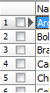

# Customizing Indicator column


The Indicator Column is usually shown at the very left part of the Grid and is colored in red color (The color varieties depending of current color scheme in the Windows). The Indicator Column can display such information as: Indicator of the current record (Is shown as triangular), State of editing, the number of the current record and checkbox of selected record. Use properties of  TDBGridEh.IndicatorOptions property to customize the Indicator Column.



```
TDBGridEhIndicatorOptions = set of TDBGridEhIndicatorOption;
TDBGridEhIndicatorOption = (gioShowRowIndicatorEh, gioShowRecNoEh, 
  gioShowRowselCheckboxesEh);
```
`gioShowRowIndicatorEh`
<dd>Display indicator of current record in the indicator column.</dd>

`gioShowRecNoEh`
<dd>Display the number of the current record in the indicator column. This property works only for DataSets that support IsSequenced mode (See Help about TDataSet.IsSequenced).</dd>

`gioShowRowselCheckboxesEh`
<dd>Display checkbox of selected record. At runtime, user can select records by clicking on check-boxes. Bookmarks of selected records are stored in the TDBGridEh.SelectedRows or TDBGridEh.Selection.Rows collection.</dd>
<br>

Use the next sub-properties of `TDBGridEh.IndicatorParams` property to customize the display of the indicator column:

`Color: TColor`
<dd>Specifies the background color for the indicator color.</dd>

`HorzLineColor: TColor`
<dd>Color of the horizontal lines in the data area.</dd>

`HorzLines: Boolean`
<dd>Presence of horizontal lines in the data area.</dd>

`VertLineColor: TColor`
<dd>Color vertical lines in the data area.</dd>

`VertLines: Boolean`
<dd>Presence of vertical lines in the data area.</dd>

`FillStyle: TGridCellFillStyleEh`
<dd>Specifies the style of filling the indicator cells.</dd>

`RecNoShowStep: Integer`
<dd>

If set to `gioShowRecNoEh` IndicatorOptions (Also the same as in `dghShowRecNo` OptionsEh), then this property specifies step with which to show record numbers in the column display. For records that fall between steps, the record number is displayed instead of a point. This eliminates the effect of "flickering" numbers, which can occur when displaying each record number.
</dd>
