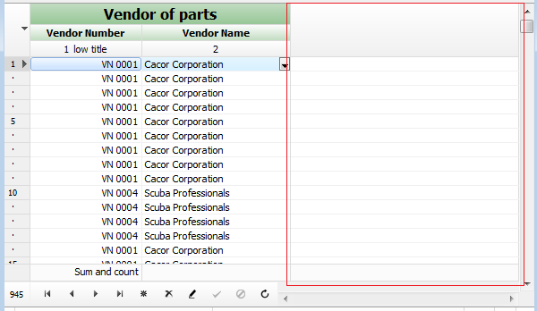

# Fill right empty part of TDBGridEh with cells like patterns

New properties are added in the `DBGridEh` class that allows to fill the empty space at the right part of the grid with cells like pattern. See a screenshot.

 
A new subproperty `HorzEmptySpaceStyle` of `TDBGridHorzEmptySpaceStyleEh` type is added to the `DBGridEh.GridLineParams` property.
A property can have the following values:

`deshNonEh` – Do not fill the empty space to the right part of the grid.

`deshExtendTitleWideSpaceEh` – Fill in the blank right header area of the grid.

`deshExtendGridWideSpaceEh` – Fill in the blank right header area and data part of the grid.
