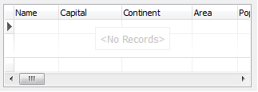

# Drawing information about the absence of records in a dataset

Grid allows to show special text in the central part of client area about absence of records in a dataset. If the DataSet is active and haven’t any record then grid will draw text `<No Records>`. Use subproperies of TDBGridEh.EmptyDataInfo property to customize Text and Font of this information. By default the text about absence of records is taken from global constant SNoData. You can set Text for every Grid using `TDBGridEh.EmptyDataInfo.Text` property or set global variable `DBGridEhEmptyDataInfoText` from `DBGridEh` unit.

