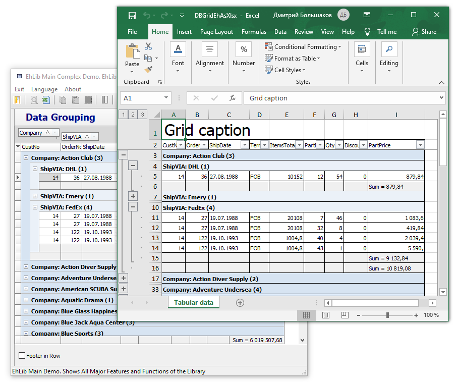

# Import/Export TDBGridEh data to/from various formats.


EhLib have a set of functions to export data from DBGridEh to `Text`, `Csv`, `HTML`, `RTF`, `XLS` and internal formats. It can write data to stream (TStream object) or to file. 

Procedures and classes to import and export data are in module `DBGridEhImpExp`.

## Data Export:
The global procedures `SaveDBGridEhToExportFile` and `WriteDBGridEhToExportStream` are used to export data.
`SaveDBGridEhToExportFile` saves data to file. `WriteDBGridEhToExportStream` saves data to a stream. The `ExportClass` parameter specifies the class that will be used to export data. The `DBGridEh` parameter sets the grid to be exported.
For example, you can use the following code to upload data in HTML format:

```pascal:no-line-numbers
procedure TfrImportExport.btnExportAsHTMLClick(Sender: TObject);
var
  Path: string;
  FileName: string;
begin
  GetDir(0,Path);
  FileName := Path + '\DBGridEh1Export.Html';

  SaveDBGridEhToExportFile(TDBGridEhExportAsHTML, DBGridEh1, FileName, RBSaveAll.Checked);
  ShellExecute(Handle, nil, PChar(FileName), nil, nil, SW_SHOWNORMAL);
end;
```

However, this method contains limitations. For example, you cannot specify that you want or do not want to dump the grid header. To solve these problems in EhLib 10.0 for exporting data in text format and in Xlsx format, hotel functions were added.

You can use this generic SaveDBGridEhToExportFile method with the following export classes:

 `TDBGridEhExportAsHTML` – To export in HTML.

 `TDBGridEhExportAsRTF` – To export in RTF format.

 `TDBGridEhExportAsXMLSpreadsheet` – to export data in the format `XML Spreadsheet`. This format is supported by Microsoft and can be used to transfer data to Microsoft Excel via the clipboard. DBGridEh component is already using this format when writing data to the clipboard, so that data can be transferred from DBGridEh in Microsoft Excel format with preservation of the font, colors and types of data. The implementation of the class is the module DBGridEh XMLSpreadsheetExp.

Deprecated classes:
 `TDBGridEhExportAsText` – to export data to a text file or stream. The class is deprecated, use the new SaveDBGridEhToTextFile, WriteDBGridEhToTextStream and WriteDBGridEhToString methods.

 `TDBGridEhExportAsUnicodeText` – To export data to a text file or stream in Unicode format. The class is deprecated, use the new SaveDBGridEhToTextFile, WriteDBGridEhToTextStream and WriteDBGridEhToString methods.
 
 `TDBGridEhExportAsCSV` – To export data to a delimited text file type ';'. You can change the separator used globally permernnuyu DBGridEhImpExpCsvSeparator or property TDBGridEhExportAsCSV.Separator. The class is deprecated, use the new SaveDBGridEhToTextFile, WriteDBGridEhToTextStream and WriteDBGridEhToString methods.
 TDBGridEhExportAsXLS – To export format VCLDBIF (This MS Excel format version 2). In this format there is a limit on the length of text characters. The length can not exceed 255. We do not recommend using this format since it is deprecated.

 `TDBGridEhExportAsOLEXLS` – To export to a format compatible with MS Excel file and use the class `TDBGridEhExportAsOLEXLS`, `TDBGridEhExportAsXlsx` or global procedures and `ExportDBGridEhToOleExcel` `ExportDBGridEhToXlsx`.

Also for export, you can use a global procedure 

```
function ExportDBGridEhToOleExcel(DBGridEh: TCustomDBGridEh; 
  Options: TDBGridEhExportAsOLEXLSOptions; IsSaveAll: Boolean = True): Variant;
```

 `TDBGridEhExportAsXlsx` – To export data in the format Xlsx. The export is performed directly to a file. The presence of additional libraries are not required. The class is deprecated, use the new `ExportDBGridEhToXlsMemFile` method.

Export is supported in Delphi XE2 and higher. For working with Export in earlier versions of Delphi you must use the third-party tools to form the Zip file version 2. For more information about unloading format Xlsx for Delphi XE2 version below read in the files section `<EhLib Archive>\ ZipProviders\`

Also for export, you can use a global procedure 

```pascal:no-line-numbers
procedure ExportDBGridEhToXlsx(DBGridEh: TCustomDBGridEh;
  const FileName: String;  Options: TDBGridEhExportAsXlsxOptions; 
  IsSaveAll: Boolean = True);
``` 

### Export to Text format:
To export data in text format, we suggest using the new functions `SaveDBGridEhToTextFile`, `WriteDBGridEhToTextStream` and `WriteDBGridEhToString`.

The functions are located in the `DBGridEhImpExp` module and have the following definition:

```pascal:no-line-numbers
procedure SaveDBGridEhToTextFile(DBGridEh: TCustomDBGridEh; 
  const FileName: String; ExportOptions:  TDBGridEhTextExportOptions);
```
<dd>Saving grid data to a file as text.</dd>

```pascal:no-line-numbers
procedure WriteDBGridEhToTextStream(DBGridEh: TCustomDBGridEh; 
  Stream: TStream; ExportOptions: TDBGridEhTextExportOptions);
```
<dd>Exporting grid data to a stream in text format.</dd>

```pascal:no-line-numbers
function WriteDBGridEhToString(DBGridEh: TCustomDBGridEh;  
  ExportOptions: TDBGridEhStringExportOptions): String;
```
<dd>Exporting grid data to a string.</dd>


`TDBGridEhStringExportOptions` class contains the following properties:

<dd>

`property ExportSelecting: Boolean;`
<dl>
  <dd>Specifies to unload only the selected grid area. If property = False, then the entire grid will be unloaded regardless of the presence of the selected MultiSelect area.</dd>
</dl><br/>

`property CellDelimiter: String;`
<dd>A string separator of cells. Default #9 (Tab code).</dd>
<br/>

`property LineDelimiter: String;`
<dd>Line separator string. The default is sLineBreak.</dd>

`property TrailingLineDelimiter: Boolean;`
<dd>The property specifies whether to unload the line separator after the last unloaded line.</dd>

`property QuoteChar: Char;`
Use QuoteChar to get or set the quote character that is used to enclose individual cell values if the value contains a substring that matches the value of the CellDelimiter, LineDelimiter, or QuoteChar property.

`property IsExportTitle: Boolean;`
<dd>The property specifies whether to write the column headings in the first row of the export.</dd>

`property IsExportFooter: Boolean;`
<dd>The property specifies whether to unload grid footers after unloading the split data.</dd>

`property UseEditFormat: Boolean;`
<dd>The property specifies that when receiving cell data as a string for numeric data and DateTime data, the string format used when editing the cell must be used. If property = False, then Column.DisplayFormat property will be used for formatting.</dd>

`property FormatSettings: TFormatSettings;`
The property specifies the format for numeric and DateTime values to be used when converting numbers and dates to text.

`property UseFormatSettings: Boolean;`
<dd>Set the property to True to indicate that the FormatSettings property should be used when converting numeric data.</dd>

`property ExportColumns: TColumnsEhList;`
<dd>List of columns to be exported. If the property is not filled, then all visible rows of the grid will be exported.</dd>

</dd><br/>

The `TDBGridEhTextExportOptions` class inherits from the `TDBGridEhStringExportOptions` class and has the following additional properties.

<dd>

  `property Encoding: TEncoding;`
  <dd>The property specifies the character encoding that will be used when writing the exported data string to a stream or file.</dd><br/>
  
  `property WriteBOM: Boolean;`
  <dd>Set the property to True to indicate to the algorithm that when writing data to a stream, a Byte Order Mark must be written to the beginning of the stream, which contains the encoding code in which the text data was written. For a description of the Byte Order Mark, see here: 
  
  https://en.wikipedia.org/wiki/Byte_order_mark
  </dd>
</dd>
<br/>


The simplest call to the `SaveDBGridEhToTextFile` procedure looks like this:

```pascal:no-line-numbers
procedure TfrImportExport.btnExportAsTxtClick(Sender: TObject);
var
  Path: string;
  FileName: string;
  ExportOptions: TDBGridEhTextExportOptions;
begin

  ExportOptions := TDBGridEhTextExportOptions.Create;
  ExportOptions.IsExportTitle := True;
  ExportOptions.IsExportFooter := False;
  ExportOptions.Encoding := TEncoding.UTF8;
  ExportOptions.WriteBOM := True;
  ExportOptions.QuoteChar := '"';
  ExportOptions.CellDelimiter :=  #09;
  ExportOptions.TrailingLineDelimiter := True;
  ExportOptions.UseEditFormat := False;

  GetDir(0,Path);
  FileName := Path + '\DBGridEh1Export.Txt';

  SaveDBGridEhToTextFile(DBGridEh1, FileName, ExportOptions);
  ExportOptions.Free;

  ShellExecute(Handle, nil, PChar(FileName), nil, nil, SW_SHOWNORMAL);
end;
```

In this example, before calling the `SaveDBGridEhToTextFile` procedure, the `TDBGridEhTextExportOptions` class is created in which the settings for exporting grid data are written.
The `TDBGridEhTextExportOptions` class has extensive properties with which to control the size of the data export format.
An example of using classes to export data to a text view can be found in the Demos\MainDemo Demo project.

### Export to Xlsx format:
In version 9.5 there was a function for unloading `DBGridEh` into an Xlsx file with the following parameters:

```pascal:no-line-numbers
procedure ExportDBGridEhToXlsx(
  DBGridEh: TCustomDBGridEh; 
  const FileName: String;  
  Options: TDBGridEhExportAsXlsxOptions; 
  IsSaveAll: Boolean = True);
```

Where Options is a combination of values
   	xlsxColoredEh		Export cell and background colors.
 	xlsxDataAsDisplayText	Unload all cell values as text.
xlsxDataAsEditText	Unload all cell values as text. Use text in edit mode. Those. don't use DisplayFormat.
We recommend using the new functions for uploading data to an Xlsx file with the following definition.

```pascal:no-line-numbers
procedure ExportDBGridEhToXlsx(
  DBGridEh: TCustomDBGridEh; 
  const FileName: String; 
  ExportOptions: TDBGridEhXlsMemFileExportOptions); overload;
```

```pascal:no-line-numbers
procedure ExportDBGridEhToXlsx(
  DBGridEh: TCustomDBGridEh; 
  const FileName: String; 
  ExportOptions: TDBGridEhXlsMemFileExportOptions; 
  ExporterClass: TDBGridEhToXlsMemFileExporterClass); overload;
```

The new version of the procedure uses the `ExportOptions` parameter of type `TDBGridEhXlsMemFileExportOptions` instead of the Options parameter.
The `TDBGridEhXlsMemFileExportOptions` class contains the following properties:

<dd>
  
  `property IsExportSelecting: Boolean`
  Export only selected area of the grid. If property = False the entire grid will be exported.
  
  `property ExportColumns: TColumnsEhList`
  List of columns to export. If you need to export all visible columns of the grid, leave the ExportColumns list empty.
  
  `property IsExportTitle: Boolean`
  Whether to export the column headings.
  
  `property IsExportFooter: Boolean`
  Whether the grid footer needs to be exported.
  
  `property IsExportFontFormat: Boolean`
  Whether it is necessary to export the font format: Name, style, color.
  
  `property IsExportFillColor: Boolean`
  Whether to export cell colors.
  
  `property IsExportCellFormat: Boolean`
  Whether to export the format of the cells. Vertical and horizontal alignment.
  
  `property IsExportDisplayFormat: Boolean`
  Whether to export the format of numbers and dates specified in the Column.DisplayFormat or NumberField/DateField.DisplayFormat property
  
  `property IsCreateAutoFilter: Boolean`
  Whether to create an autofilter region.
  
  `property IsExportFreezeZones: Boolean`
  Whether to export fixed, non-scrollable zones. Zones are created based on the Grid Header and Frozen columns.
  
  `property IsFooterSumsAsFormula: Boolean`
  Whether it is necessary to convert the calculated Sum and Count values into Excel formulas before exporting the footer.
  
  `property IsExportDataGrouping: Boolean`
  Whether to export the grouping structure of the grid records.
  
  `property GridHeaderText: String`
  General grid header.
  
  `property GridHeaderFont: TFont;`
  Grid common header font.
  
  `property GridHeaderFontStored: Boolean;`
  Grid common header font is assigned. If the property value is False, then the default font used by Excel will be used. When the GridHeaderFont property is changed, the value of this property is automatically changed to True.
  
  `property GridFooterText: String;`
  General grid footer. The text data is added to the Worksheet in the grid data.
  
  `property GridFooterFont: TFont;`
  The grid's common footer font.
  
  `property GridFooterFontStored: Boolean;`
  The grid's common footer font is assigned.
  
  `property SheetName: String;`
  Worksheet page name.
</dd><br/>

Parameter `ExporterClass: TDBGridEhToXlsMemFileExporterClass`
<dd>

This parameter must point to a class inherited from `TDBGridEhToXlsMemFileExporter`. Calling the  `ExportDBGridEhToXlsx` procedure with the given parameters should be used when it is necessary to change the export algorithm or formatting details when exporting data from DBGridEh to an Xlsx file. Before calling the procedure, write an inheritor from the `TDBGridEhToXlsMemFileExporter` class and override the necessary virtual functions responsible for the necessary export details. When calling the `ExportDBGridEhToXlsx` procedure, pass a pointer to the inherited class. The procedure will create an instance of the specified class and will use it to export data.
</dd>

Here is an example of calling the `ExportDBGridEhToXlsx` procedure without the ExporterClass parameter:

```pascal:no-line-numbers
procedure TForm1.actExportToExcelExecute(Sender: TObject);
var
  Grid: TDBGridEh;
  Path: String;
  FileName: String;
  ExportOptions: TDBGridEhXlsMemFileExportOptions;
begin
  Grid := TDBGridEh(ActiveControl);

  GetDir(0, Path);
  FileName := Path + '\DBGridEhAsXlsx.Xlsx';

  ExportOptions := TDBGridEhXlsMemFileExportOptions.Create;
  ExportOptions.IsExportAll := True;
  ExportOptions.IsExportTitle := True;
  ExportOptions.IsExportFooter := True;
  ExportOptions.IsExportFontFormat := True;
  ExportOptions.IsExportFillColor := True;
  ExportOptions.IsCreateAutoFilter := True;
  ExportOptions.IsExportFreezeZones := True;
  ExportOptions.IsFooterSumsAsFormula := True;
  ExportOptions.IsExportDisplayFormat := True;
  ExportOptions.IsExportDataGrouping := True;
  ExportOptions.SheetName := 'Text';

  ExportOptions.GridHeaderText := 'GridHeaderText';
  ExportOptions.GridHeaderFont := Grid.Font;
  ExportOptions.GridHeaderFont.Size := 24;

  ExportOptions.GridFooterText := 'GridFooterText'

  ExportDBGridEhToXlsx(Grid, FileName, ExportOptions);

  ExportOptions.Free;

  ShellExecute(Handle, nil, PChar(FileName), nil, nil, SW_SHOWNORMAL);
end;
```

Data export result: Screenshort
 


The new version also adds procedures for unloading data into the intermediate TXlsMemFileEh object.

```pascal:no-line-numbers
procedure ExportDBGridEhToXlsMemFile(
  DBGridEh: TCustomDBGridEh;
  XlsFile: TXlsMemFileEh; 
  ExportOptions: TDBGridEhXlsMemFileExportOptions);
```

```pascal:no-line-numbers
procedure ExportDBGridEhToXlsMemFile(
  DBGridEh: TCustomDBGridEh; 
  XlsFile: TXlsMemFileEh; 
  ExportOptions: TDBGridEhXlsMemFileExportOptions; 
  ExporterClass: TDBGridEhToXlsMemFileExporterClass);
```

You can use these functions to unload data first into an object of type `TXlsMemFileEh`, note to make additional changes in the `XlsMemFile` object, and after that save the data to a file on disk.

Exporting data from DBGridEh to `TXlsMemFileEh` using the `TDBGridEhToXlsMemFileExporter` class.

By using the `TDBGridEhToXlsMemFileExporter` class directly, you gain even more flexibility when exporting data to an `XlsMemFile` and then saving the data to an Xlsx file.

For example, the `TDBGridEhToXlsMemFileExporter` class has properties such as Worksheet, FromCol, and FromRow. Using the Worksheet property, you can specify which specific workbook to export to. The FromCol and FromRow properties set the starting column and row from which to start generating the export data.
Having written an inheritor from `TDBGridEhToXlsMemFileExporter`, you can overload the virtual methods of the class to change the format of data export.
Below is the implementation of the ExportDBGridEhToXlsMemFile procedure, which you can understand how to use the `TDBGridEhToXlsMemFileExporter` class.

```pascal:no-line-numbers
procedure ExportDBGridEhToXlsMemFile(
  DBGridEh: TCustomDBGridEh; 
  XlsFile: TXlsMemFileEh;
  ExportOptions: TDBGridEhXlsMemFileExportOptions; 
  ExporterClass: TDBGridEhToXlsMemFileExporterClass);
var
  Exporter: TDBGridEhToXlsMemFileExporter;
begin
  if ExporterClass <> nil
    then Exporter := ExporterClass.Create
    else Exporter := TDBGridEhToXlsMemFileExporter.Create;

  Exporter.XlsFile := XlsFile;
  Exporter.Grid := DBGridEh;
  if ExportOptions <> nil then
    Exporter.ExportOptions := ExportOptions;

  Exporter.ExportGrid;

  Exporter.Free;
end;
```

Here in the code:
If `ExporterClass` is not specified, then the default `TDBGridEhToXlsMemFileExporter` class is used.
The `XlsFile`, `DBGridEh` and `ExportOptions` object is assigned.
 `Exporter.ExportGrid` method exports data.
Once exported, the Exporter object is no longer needed and is removed. The generated data remains in the XlsFile class.
The `TDBGridEhToXlsMemFileExporter.Worksheet` property is not assigned to the code. Therefore, the Exporter renders data on the first workbook from the Workbook.Worksheets collection.

## Data Import:
To import data, you can use the following classes:
`TDBGridEhImportAsText` – to import a text file or stream in which the values of the fields are separated by VK_TAB (#09).
`TDBGridEhImportAsUnicodeText` - to import a text file or stream in Unicode format.
`TDBGridEhImportAsVCLDBIF` – This data format used for the data transfer of one grid to another via the clipboard data.
