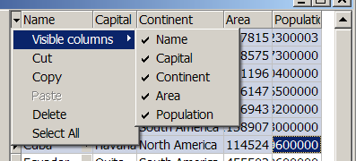

# Using properties of TDBGridEh.IndicatorTitle

Using properties of the `TDBGridEh.IndicatorTitle` object you can control the behavior of the grid when the left-top cell is clicked.

Set `TitleButton` property to True value to make top-left cell working as button. When `TitleButton` is True the properties `DropdownMenu` and `UseGlobalMenu` are also taken into consideration. If `UseGlobalMenu` is True then grid will form the dropped down menu using global property `DBGridEhCenter.IndicatorTitleMenus`. If `DropdownMenu` is also assigned then all elements of this menu will be added to the dropped down menu after elements of global menu.
`TDBGridEh.IndicatorTitle` property have the following sub-properties:

`DropdownMenu: TPopupMenu`

<sh>Define a drop-down menu whose items will be displayed when you click on the cell IndicatorTitle </sh>

`ShowDropDownSign: Boolean`

<sh>Specifies whether to display a black triangle pointing down in the top left cell</sh>

`TitleButton: Boolean`

<sh>Specifies that the upper-left cell works as a button</sh>

`UseGlobalMenu: Boolean`

<sh>

In forming the pull-down menu to use the properties of the global object - `DBGridEhCenter.IndicatorTitleMenus`.
</sh>
