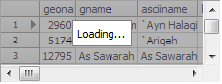

# "Blackout" of the grid while loading a data


`TDBGridEh` allows you to "black out" (dim) grid while loading data. This allows you to show the user that a melon time `DataSet` loads data from the server. Grid in the dark makes a smooth transition from the standard picture to a darkened and back. Use `StartLoadingStatus` `FinishLoadingStatus` methods to display the status of downloading and reset it back respectively. 

You can call methods that reload the data in `DataSet` between calls to these methods.



`StartLoadingStatus` and `FinishLoadingStatus` procedures have the following parameters:


```pascal:no-line-numbers
procedure StartLoadingStatus(
const LoadingCaption : String = ''; // Text for Downloading status
RenderDuration: Integer = -1 // Duration of the transition state
);

procedure FinishLoadingStatus(
RenderDuration: Integer = -1 // Duration of the transition state
);
```
