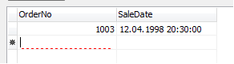

# Highlighting fields require input values

The `DataSet` fields that require that data entry, property `Field.Required` is set to `True`. If you try to move to a new record in `DataSet` (grid) did not complete one of the fields requires a value, `DataSet` throw an exception, and will not leave the post until the field will not be filled or recording all changes will be canceled.

The grid has the ability to highlight a cell in which there are fields with mandatory values. Set `TDBGridEh.ColumnDefValues.HighlightRequired` or `TColumnEh.HighlightRequired` to highlight such cells. Grid will emphasize the red dotted line required input values.

You can also write to the event `TColumnEh.OnCheckDrawRequiredState` to manage when you have to draw a line indicator of mandatory data entry. In the event handler will set `DrawState` parameter to `True` to display a line-indicator for the relevant records and fields.

