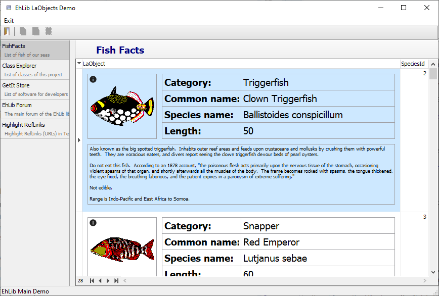
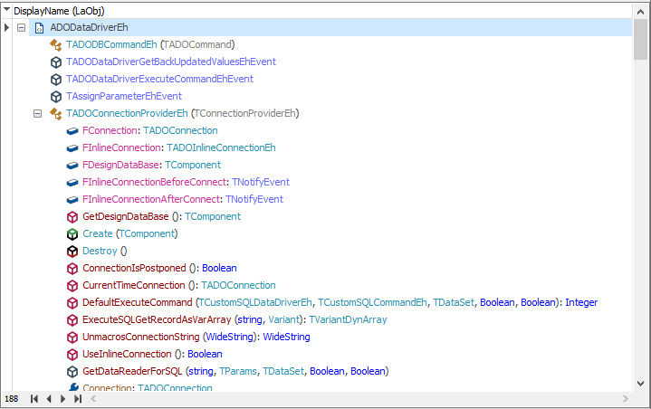
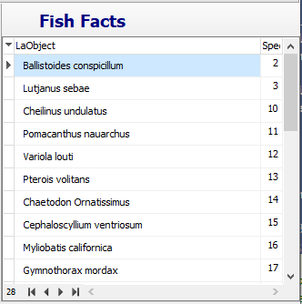
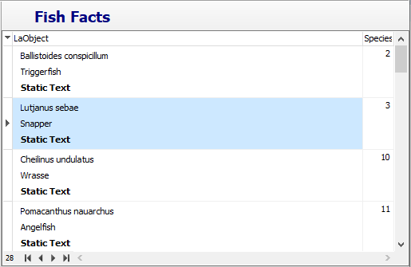
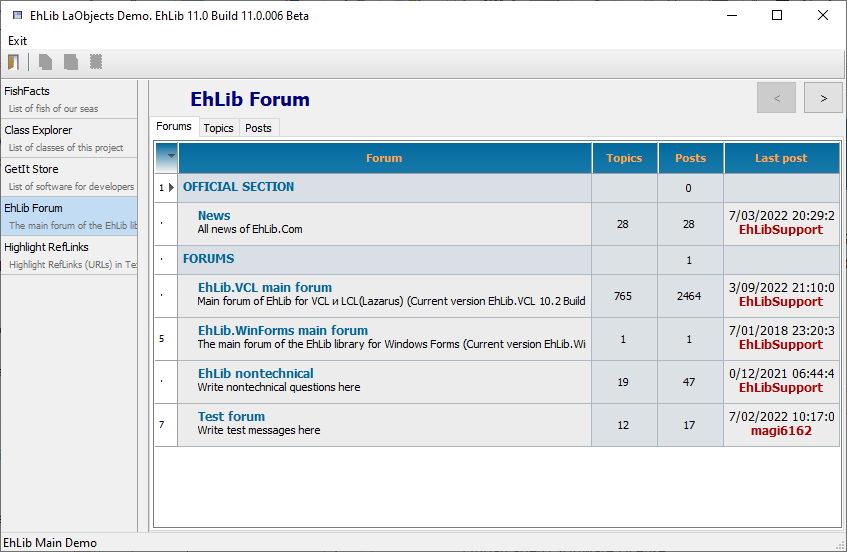
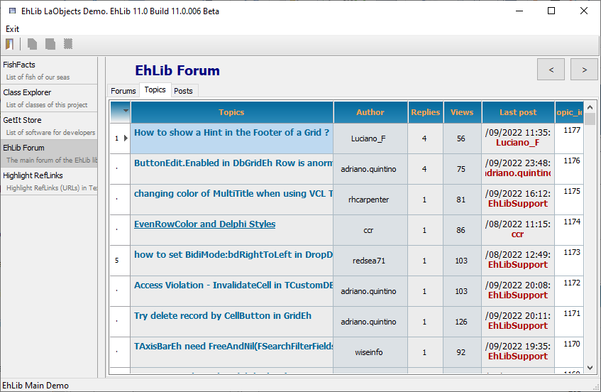
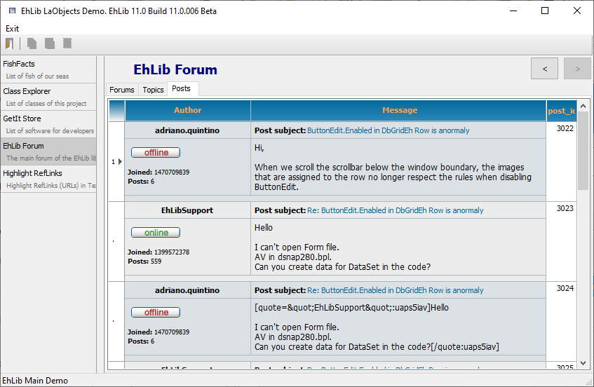

# Complex formatting in grid cells (LaControls)


This section describes the advanced formatting features in grid cells in EhLib version 11.0 or higher.

There are a mechanism for creating visual cells with complex formatting to DBGridEh.
In grid cells, this formatting looks like `RichText` or `HTML` text.

At the same time, the formatting is not based on either the Rtf format or the HTML markup.

Formatting is based on internal classes that describe the layout of the elements inside the cell.
For formatting, special Layout Controls are used (Location elements, LaControls)

Here are examples of visual representations that can be created using LaControls elements.





For examples of using LaControls elements, see the Demo project<br>
`<EhLib Archive>\Demos\LaObjects.MainDemo.`

#### Creating a LaControls Element Tree Template.

In order for a grid cell to start rendering its content through LaControls elements, you need to create a placement description template and assign it to the `TColumnEh.LaControlTemplate` property. The grid will use a template to render the contents of the cell for each grid entry.

The template may contain references to DataSet fields. To do this, use the element's FieldName property. When rendered, the element will substitute the field value for each record in the DataSet.

In the current implementation, the library supports the creation of a tree of elements only in the program code. Working with elements in Design-time is not supported.

Below is a simple example of creating an element tree.

```pascal:no-line-numbers
constructor TfrOneFishFacts.Create(AOwner: TComponent);
var
  ALaControl: TLaObjectEh;
begin
  inherited Create(AOwner);
 
  with TLaTextBlockEh.Create(Self) do
  begin
    FieldName := 'Species_Name';
    Margins.SetBounds(10, 5, 5, 2);
 
    ALaControl := RefSelf;
  end;
 
  DBGridEh1.Columns[0].LaControlTemplate := ALaControl;
end;
```

The result will look like this:



In this example, we've created one LaControl of type TLaTextBlock , set padding from the edge of the cell, and specified that the LaControl should output values from the `'Species_Name'` field. Then we use this LaControl as a template for the `DBGridEh1.Columns[0]` column.

This example does not contain complex formatting. We could implement this formatting without LaControls. But for the first time this is enough. In any case, we can already set the margins from the edges of the cell through the Margins property.

#### Panels
Panels allow you to group several elements into a group and arrange them on the screen according to certain rules.

In the current implementation, the library contains three types of panels: 
- `TLaContentPanelEh` - Simple panel container. Arranges multiple elements in the same area without a special layout algorithm.
- `TLaStackPanelEh` - Container stack panel. Arranges the element sequentially one after the other from left-to-right or top-to-bottom.
- `TLaGridPanelEh` - Gridpanel container. Arranges elements in panel cells with columns and rows.

Consider the use case of the TLaStackPanelEh element.

```pascal:no-line-numbers
// Variant 2. Simple TLaStackPanelEh
constructor TfrOneFishFacts.Create(AOwner: TComponent);
var
  ALaControl: TLaObjectEh;
begin
  inherited Create(AOwner);
 
  with TLaStackPanelEh.Create(Self) do
  begin
    Orientation := TLaOrientation.Vertical;
 
    with TLaTextBlockEh.CreateWith(Self, RefSelf) do
    begin
      FieldName := 'Species_Name';
      Margins.SetBounds(10, 5, 5, 2);
    end;
 
    with TLaTextBlockEh.CreateWith(Self, RefSelf) do
    begin
      FieldName := 'Category';
      Margins.SetBounds(10, 5, 5, 2);
    end;
 
    with TLaTextBlockEh.CreateWith(Self, RefSelf) do
    begin
      Text := 'Static Text';
      Font.Style := [fsBold];
      Margins.SetBounds(10, 5, 5, 2);
    end;
 
    ALaControl := RefSelf;
  end;
 
  DBGridEh1.Columns[0].LaControlTemplate := ALaControl;
end;
```

The result will look like this:



Here, the with statement and the special CreateWith constructor are used to add nested elements.

Here is a list of available elements and panels of the library.

`TLaObjectEh`  
&nbsp;&nbsp;&nbsp;&nbsp;Unit: `LaObjectsEh`
<dd>Base element for all placement elements.</dd>

`TLaControlEh`  
&nbsp;&nbsp;&nbsp;&nbsp;Unit: `LaControlsEh`
<dd>Placement element with font, padding and border rendering settings.</dd>

`TLaTextBlockEh`  
&nbsp;&nbsp;&nbsp;&nbsp;Unit: `LaControlsEh`
<dd>Placement element to display plain text.</dd>

`TLaImageEh`  
&nbsp;&nbsp;&nbsp;&nbsp;Unit: `LaControlsEh`
<dd>Placement element for displaying pictures.</dd>
		
`TLaFlowRichBlockEh`  
&nbsp;&nbsp;&nbsp;&nbsp;Unit: `LaFlowRichBlocksEh`	
<dd>Placement element for text with the ability to set individual formatting for sections of text.</dd>
		
`TLaGridPanelEh`  
&nbsp;&nbsp;&nbsp;&nbsp;Unit: `LaGridPanelsEh`	
<dd>Grid container. Arranges elements in panel cells with columns and rows.</dd>
		
`TLaContentPanelEh`  
&nbsp;&nbsp;&nbsp;&nbsp;Unit: `LaPanelsEh`
<dd>The container is a simple panel. Arranges multiple elements in the same area without a special layout algorithm.</dd>

`TLaStackPanelEh`  
&nbsp;&nbsp;&nbsp;&nbsp;Unit: `LaPanelsEh`	
<dd>Container-stack panel. Arranges the element sequentially one after the other from left-to-right or top-to-bottom.</dd>
		
`TLaHintWindowEh`  
&nbsp;&nbsp;&nbsp;&nbsp;Unit: `LaHintWindows`
<dd>Window for displaying hints with the ability to format content through LaControls.</dd>

`LaObjectTreeViewForms`
<dd>Window for tree view of LaControls location and property of each element at Run-time. Used to test the display of a complex set of elements.</dd>


Below are also a few screenshots from which you can understand the possibilities of displaying complex data that this technology provides.







