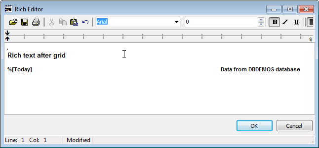

# Rich text before and after grid


`TPrintDBGridEh` allows to print/preview rich text before and after grid. Use `AfterGridText` and `BeforeGridText` to specify text. Using `SetSubstitutes` method you can substitute text in `BeforeGridText` and `AfterGridText` properties upon print/preview process.

`TPrintDBGridEh` allows to print `Rich text` before and after grid. To do this, use `AfterGridText` and `BeforeGridText` properties. Also, using the method `SetSubstitutes`, you can specify the substitution text in the `BeforeGridText` and `AfterGridText` properties in print / preview. A property of `AfterGridText` and `BeforeGridText` have type `TStrings`, although store a data type `TRichEditStrings`.

Below is an example code for printing Rich text with the possibility of substitution:



```pascal:no-line-numbers
PrintDBGridEh1.SetSubstitutes(['%[Today]',DateToStr(Now)]);
PrintDBGridEh1.Preview;  
```