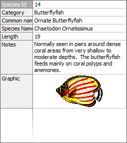

# General concepts of TDBVertGridEh component

Component `TDBVertGridEh` is a visual component such like a vertical grid. The component is used to display and edit a single `DataSet` record in a vertical orientation. The data is displayed in two columns. The first column displays the names of the fields and the second column show values of the current record.

In the general case, the each row in the component corresponds to a one field in the `DataSet`.

`TDBVertGridEh` and `TDBGridEh` components have a common ancestor - `TCustomDBAxisGridEh` and have similar functionality. TDBGridEh component can be regarded as a table with a horizontal display of records and TDBVertGridEh as vertical. In the current version of EhLib TDBVertGridEh can display only one record on the screen.

If you've worked with TDBGridEh component, then for understanding the properties of the components TDBVertGridEh their properties can be compared as follows:

|Properties of TDBGridEh   |Description   |Properties of TDBVertGridEh  |Description   |
|---|---|---|---|
|Columns   |Columns of the grid, that corresponds to fields of the dataset.   |Rows   |Rows of the grid, that corresponds to fields of the dataset.   |
|Options   |Setting up the basic properties DBGirdEh.   |Options   |Setting up the basic properties DBVertGridEh.   |
|ColumnDefValues   |The default values for columns TColumnEh.   |RowsDefValues   |The default values for rows TFieldRowEh.   |
|GridLineParams   |Color settings of dividing lines in the grid.   |GridLineParams   |Property works similarly.   |
|\<There is no analog\>   |-   |DataColParams   |Configuring column display data.   |
|TitleParams   |Configuring the column headings of a column.   |LabelColParams   |Configuring the column headers display rows of data.   |
|IndicatorParams   |Configuring the indicator column   |\<There is no analog\>   |   |
|Flat   |Paint 3D grid cell in a slightly raized state.   |Flat   |Property works similarly.   |
|DrawGraphicData   |Display graphical data from fields like TGraphicField   |DrawGraphicData   |Property works similarly.   |
|DrawMemoText   |Display text data from Memo fields.   |DrawMemoText   |Property works similarly.   |

