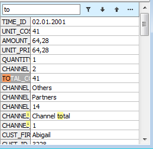

# DBVertGridEh.SearchPanel

`DBVertGridEh` allows to search data in one record of `DataSet` via `SearchPanel`, as is done in `TDBGridEh`.

`TDBVertGridEh` have a `SearchPanel` property with next sub properties:

`Enabled: Boolean;`

<dd>
Search Panel is available in DBVertGridEh. The Search Panel can be hidden for the user if PersistentShowing = False.
</dd>

`FilterEnabled: Boolean;`

<dd>
Specifies that Search Panel results can be filtered.
</dd>

`FilterOnTyping: Boolean;`

<dd>
Specifies that filtering must be performed as a text is being typed in the Search Panel editor.
</dd>

`PersistentShowing: Boolean;`

<dd>
Specifies that SearchPanel is always visible in TDBVertGridEh. If PersistentShowing = False, the user can display and activate SearchPanel by pressing the key combination defined by a ShortCut property.
</dd>

`ShortCut: TShortCut`

<dd>
Sets the key combination by which a focus transfer to the Search Panel text editor.
</dd>

`CaseSensitive: Boolean`

<dd>
Specifies the text case sensitivity when searching via Search Panel.
</dd>

`WholeWords: Boolean `

<dd>
Specifies that the search must be performed by the whole words when searching via Search Panel.
</dd>

