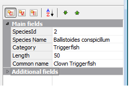

# Grouping rows by Category

`TDBVertGridEh` component allows you to group rows into categories. Use sub-properties of `TDBVertGridEh`.

`RowCategories` property to manage a categories.

Grid lines can be grouped into categories based on:
- Сategory name
- Field type 
- Presence / absence of values in the current record.

To activate the grouping by category, set `TDBVertGridEh.RowCategories.Active` property to `True`.

Type used to group categories defined by the property `CategoryGroupingType`. `CategoryGroupingType` has `TCategoryGroupingTypeEh` type and can contain the following values:

<dl>

<sh>

`cgtFieldRowCategoryNameEh` - Form category basing on `TFieldRowEh.CategoryName` property value. The number of categories determined by the number of unique values in the list of `TDBVertGridEh.Rows[i].CategoryName` values. Additional properties of the categories can be set using the properties of the `TDBVertGridEh.RowCategories`.CategoryProps collection.
</sh>

<sh>

`cgtEmptyNotEmptyValueEh` - To form category based on the presence of values in fields in `DataSet`. The grid line will fall into one of two categories. Category 1 - a field in which the values of the current record is not Null. Category 1 - a field in which the values of the current record = Null.
</sh>

<sh>

`cgtFieldDataTypeEh` - To form category based on the type of fields. Fields will fall into one of the following categories: Text fields, numeric fields, Logical fields, field type DateTime fields such as BLOB, another type of field.
</sh>

</dl>

With the `TDBVertGridEh.RowCategories.CategoryProps` property you can specify additional parameters such as: 

`DisplayText` – The text that will be displayed in the grid 

`DefaultExpanded` – Status Expanded / Collapsed category as the branches of a tree on the first grid displayed on the screen.
Simply create a collection element listed as the Name property in the name of the category and is additionally specify a property.

Use sub-properties of a `TDBVertGridEh.RowCategories` property to set `Color` `Font` `ParentFont` to adjust the font and color of the grouping string category.

Using the `TDBVertGridEh.RowCategories.RowMoveOptions` property you can allow `Categories` to move by mouse at the `Run-Time`, and move the items from category to category.

Use `OnRowCategoriesNodeExpanded` and `OnRowCategoriesNodeCollapsed` events to perform certain actions when a user opens and closes certain category.

