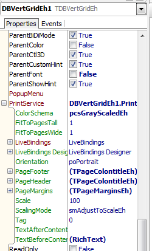
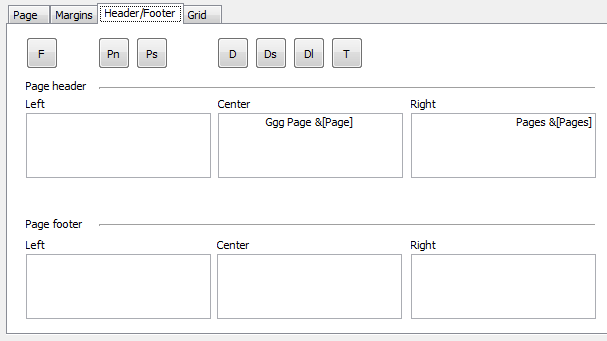
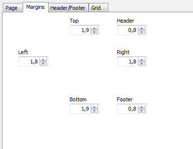
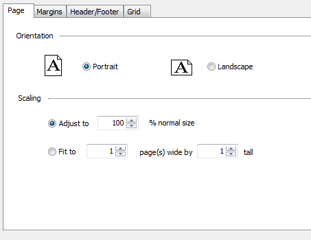

# Printing of TDBVertGridEh


The `DBVertGridEh` components can be printed and previewed before printing.

See Demo project in the folder – 
`DEMOS\PrintGrids`

Use subproperties of `PrintService`  property  to configure and manage printing:

A set of properties and methods of `PrintService` property is identical for all components `TDBVertGridEh`, `TPivotGridEh` and `TPlannerControlEh`.
The property is accessible at Design-Time.


 

PrintService property contains the following sub-properties:
property name	property type	Description
 `ColorSchema`	TPrintColotSchemaEh	pcsFullColorEh - Full color
 pcsAdaptedColorEh - Adapted for printing (for example, the dividing lines in this mode are always printed in black.)
 pcsBlackAndWhiteEh - Fully black-and-white drawing. 

 `FitToPagesTall: Integer`
 When ScalingMode = smFitToPagesEh, FitToPagesTall specifies the number of pages that need to fit the contents of the height.

 `FitToPagesWide: Integer`
 When ScalingMode = smFitToPagesEh, FitToPagesTall specifies the number of pages that need to fit the contents of the width.

`Orientation: TPrinterOrientation`
  poPortrait - Portrait orientation sheet.
   poLandscape – Landscape page orientation.

`PageFooter: TPageColontitleEh`
	Specifies the texts that will appear in the footer of the page.

`PageHeader: TPageColontitleEh`
  Specifies the texts that will appear in the page header.

`PageMargins: TPageMarginsEh` Indent and page headers and footers.

`Scale: Integer`
   It sets out a percentage. Default is 100.

`ScalingMode: TScalingModeEh`
    smAdjustToScaleEh - Scale using the FitToPagesTall and FitToPagesWide properties.
    smFitToPagesEh - Scale using the Scale property.

`TextAfterContent: TRichStringEh`
	Rich Text to be printed before the contents of the grid.
`TextBeforeContent: TRichStringEh`
Rich Text to be printed after the contents of the grid.


Use `PrintService.Print` and `PrintService.Preview` methods to print components  at Runtime:

```pascal
  DBVertGridEh1.PrintService.Preview;
```  

Use the properties for the print settings as follows:
The header and footer of the page:

```pascal
    property PrintService.PageFooter;
    property PrintService.PageHeader;
```  


 


Page margins

```pascal
    property PrintService.PageMargins: TPageMarginsEh;
```  




Orientation and Scaling:

```pascal
property ColorSchema: TPrintColotSchemaEh;
property FitToPagesTall: Integer;
property FitToPagesWide: Integer;
property Orientation: TPrinterOrientation;
property Scale: Integer;
property ScalingMode: TScalingModeEh;
```  


 

PrintService property contains the following events:
```pascal
OnBeforePrint;
OnBeforePrintPage;
OnBeforePrintPageContent;
OnPrintDataBeforeGrid;
OnCalcLayoutDataBeforeGrid;

OnAfterPrint;
OnAfterPrintPage;
OnAfterPrintPageContent;
OnPrintDataAfterGrid;
OnCalcLayoutDataAfterGrid;
```  

