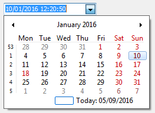
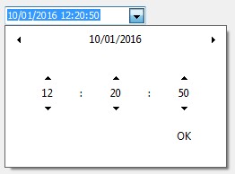
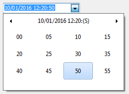

# The drop-down calendar with date and time enter pages


In the library there is an control to display a drop-down calendar that can work in special modes:
    




- Input the date and time simultaneously, 
- Input only the date
- Input only the time 

The drop-down calendar starts work automatically in `DBDateTimeEditEh` component and in a text editor of and `DBGridEh` and `DBVertGridEh` components for `TDateTimeField` field.

  	 	 

The drop-down calendar automatically hides the unused part of the date and time windows, depending on the `EditFormat` property (or DisplayFormat for `TColumnEh` in the `DBGridEh` and `TFieldRow` in the `DBVertGridEh`).

For example: For `EditFormat = 'HH:NN'` drop-down calendar is as follows and will allow only enter hours and minutes.

 

With global properties of library, you can configure the following capabilities a calendar.

- Highlight Weekend.

Property - ToolCtrlsEh.EhLibManager.DateTimeCalendarPickerHighlightHolidays: Boolean

- Highlight holidays. 

For highlighting holidays and transfer of working days, use `TWorkingTimeCalendarEh` class.

Inherit TWorkingTimeCalendarEh class and override a method -

```pascal
function IsWorkday(ADate: TDateTime): Boolean;
```

The method should return True if the ADate parameter is working days.
In the code of your program register your new object once for a working calendar using global procedure – `RegisterGlobalWorkingTimeCalendar` like this:

```pascal
RegisterGlobalWorkingTimeCalendar(TMyWorkingTimeCalendarEh.Create(nil)).Free;
```

This method registers a class that controls weekends and holidays that affect the highlight of days in the calendar and the `TPlannerCalendarPickerEh` component.

The method returns old object that controlled working days. Usually the old object is destroyed immediately.

- To customize the color display holidays and weekends use next global object and property.

```pascal
property PlannerCalendarPickerDrawStyleEh.HolidayBaseFontColor: TColor
```

- Do not show the timing tab in all drop-down calendars of the program.
```pascal
property ToolCtrlsEh.EhLibManager.DateTimeCalendarPickerShowTimeSelectionPage: Boolean
```
Use global `DateTimeCalendarPickerShowTimeSelectionPage` property to enable or disable display of timing tab in the all drop-down calendars of the program.

By default `DateTimeCalendarPickerShowTimeSelectionPage = true`.

- DropDown calendar also support Delphi VCL styles.

Here is a screenshot from `PlannerEh.MainDemo` project that shows what properties you can use to customize DropDown calendar.
 

See the next Demo project to see how to work with DropDown Calendars:

`<EhLib Archive>\Demos\CalendarPickerEh`

`unit Frame3_Options`

`unit Unit_ToolsDataModule`

and

`<EhLib Archive>\Demos\PlannerEh.MainDemo\`

`unit FrameOptions `

`unit Unit_ToolsDataModule`
