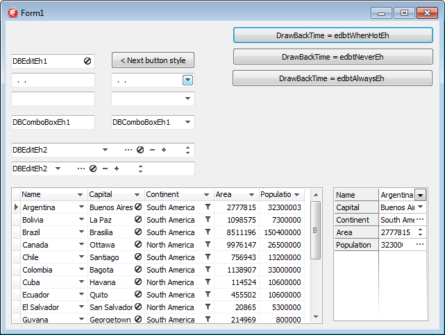

# Working with edit buttons


All editing control, as well as columns (For DBGridEh) and `TFieldRow` (For DBVerGridEh) contains two properties - `EditButton` and `EditButtons`.

&nbsp;&nbsp;&nbsp;&nbsp;&nbsp;
 	  	 

`EditButton` specifies parameters for editing buttons. The buttons are displayed in the editing or editing control within the grid cell. To activate a button, use the property `EditButton`. If the control is necessary to have some buttons, create additional editing buttons collection `EditButtons`. 

`DefaultAction`

The class TEditButtonEh added property - `DefaultAction`.
This class is used in components for `TColumnEh` `DBGridEh`, `TFieldRowEh` for `DBVertGridEh`, `DBEditEh.EditButtons[i]`, `DBNumberEditEh.EditButton`, `DBNumberEditEh.EditButtons[i]`, `DBDataTimeEditEh.EditButton`, `DBDataTimeEditEh.EditButtons[i]`.

It specifies whether you want to perform a default action when you press the `EditButton`. Default actions depend on the component. For example, DBNumberEditEh default action is - the opening of a drop-down calculator. The other components of this will be another popup window for editing values. `DefaultAction` established in False, you cancel the opening of the pop-ups or other action by default.

`DrawBackTime`

It is allowed display the edit buttons in transparent background mode. In this mode, the edit button shows only a foreground icon. See the second screenshort.

&nbsp;&nbsp;&nbsp;&nbsp;&nbsp;

            

### Limitations and Compatibility: 
1.	Not all types of buttons correctly support the drawing mode. For example such types as  ebsDropDownEh ebsUpDownEh use Windows style to draw data and they can’t draw Background and Foreground part separately. For these buttons use alternative types - ebsAltDropDownEh and ebsAltUpDownEh.

2.	Transparent back drawing does not work when the button have ebsGlyphEh style and the picture is in the Glyph property. To get around the restriction move a picture in TImageList component and fill EditButton.Images property.

Use the following types of properties to set a transparent background for Buttons:
Types 

TEditButtonDrawBackTimeEh = (edbtAlwaysEh, edbtNeverEh, edbtWhenHotEh);
	edbtAlwaysEh – Always draw the button background
	edbtNeverEh – Never draw the button background
	edbtWhenHotEh – Draw button background when a mouse cursor is over the button.

Properties
```
property TColumnEh.EditButton.DrawBackTime: TEditButtonDrawBackTimeEh
property TColumnEh.EditButtons[i].DrawBackTime: TEditButtonDrawBackTimeEh
```
Sets a drawing mode for button background in the column editor.

```
property TColumnEh.EditButton.DrawBackTimeStored: Boolean
property TColumnEh.EditButtons[i].DrawBackTimeStored: Boolean
```

Determines that the value of a `DrawBackTime` property is persistent and does not depend on the value of other properties. If `DrawBackTimeStored = False`, the default value for the `DrawBackTime` property is taken from `TDBGridEh.ColumnDefValues`.`EditButtonDrawBackTime` property.

```
property TDBGridEh.STFilter.FilterButtonDrawBackTime: TEditButtonDrawBackTimeEh
```
Sets a drawing mode for button background of STFilter buttons.

```
property TDBGridEh.STFilter.FilterButtonDrawBackTimeStored: Boolean
```

Determines that the value of a `FilterButtonDrawBackTime` property is persistent and does not depend on the value of other properties. If `DrawBackTimeStored = False`, the default value for the `FilterButtonDrawBackTime` property is taken from `TDBGridEh`. `ColumnDefValues.EditButtonDrawBackTime` property.

```
property TDBGridEh.ColumnDefValues.EditButtonDrawBackTime: TEditButtonDrawBackTimeEh
```

Sets a drawing mode for column editor buttons and STFilter buttons.
Similar properties are present in the classes of DBVertGridEh component

```
property TFieldRowEh.EditButton.DrawBackTime: TEditButtonDrawBackTimeEh
property TFieldRowEh.EditButtons[i].DrawBackTime: TEditButtonDrawBackTimeEh
property TFieldRowEh.EditButton.DrawBackTimeStored: Boolean
property TFieldRowEh.EditButtons[i].DrawBackTimeStored: Boolean
property TDBVertGridEh.RowsDefValues.EditButtonDrawBackTime: TEditButtonDrawBackTimeEh
```

Similar properties are present in the classes of TDBEditEh, TDBNumberEditEh, TDBDateTimeEditEh components
```
property TDBEditEh.EditButtons[i].DrawBackTime: TEditButtonDrawBackTimeEh
property TDBEditEh.EditButtons[i].DrawBackTimeStored: Boolean
```

For an example of using properties for transparent background see the next demo project:
`DEMOS\EditButton.DrawNoBack`


### OnClick, OnDown

You can write event handler on the mouse down click or mouse click of an Edit button. To do this, write an event handler or OnButtonDown OnButtonClick konrolya for editing. For TColumnEh (For DBGridEh) or TFieldRow (For DBVerGridEh) events have names OnEditButtonDown and OnEditButtonClick. If you create a button through a collection EditButtons, then write event of a collection TEditButtonsEh: TEditButtonEh.OnClick или TEditButtonEh.OnDown.

### Properties

To adjust the display of edit button, use the following properties 

`TDBGridEh.ColumnDefValues.AlwaysShowEditButton` – The property specifies whether to display the edit button in the grid constant. The value of a property applies to all the columns of the grid.

`TColumnEh.AlwaysShowEditButton` – Specifies whether to display the edit button in the grid constant for a given any column.

`TDBGridEh.EditButtonsShowOptions` – Specifies additional parameters map editing buttons when TDBGridEh.ColumnDefValues.`AlwaysShowEditButton = True` or `TColumnEh.AlwaysShowEditButton = True`. 

`EditButtonsShowOptions` property can contain the following values:
<dl>
<sh>
	
`sebShowOnlyForCurCellEh` 	-	Display the edit button for the current cell in the grid
	
`sebShowOnlyForCurRowEh`	-	Display the edit button for the current record in the grid
	
`sebShowOnlyWhenGridActiveEh` -	Display edit buttons only when the grid has input focus
	
`sebShowOnlyWhenDataEditingEh` -	Display edit buttons only when the DataSet is in edit mode.
</sh>
</dl>

The TEditButtonEh class contains the following properties:

`Action: TBasicAction`

<sh>An instance of TBasicAction or the heir of him. Components such as Action created in the Design-Time using components TActionList. By assigning component Action property TEditButtonEh.Action he will be called by clicking on the edit button.</sh>

`DefaultAction: Boolean`

<sh>Specifies whether to call a default action when user press the button. The default action depends on the type of field TColumnEh.Field.</sh>

`DropdownMenu: TPopupMenu`

<sh>If you set this property PopupMenu component type drop-down menu that will be displayed when you click on the Edit button.</sh>

`DropDownFormParams: TDropDownFormCallParamsEh`

<sh>It allows you to configure a button to display a drop-down form DropDownForms.</sh>

`Enabled: Boolean`

<sh>Buttons available for press</sh>

`Glyph: TBitmap`

<sh>The picture to be displayed on the button</sh>

`Hint: String`

<sh>Tip to be displayed when you hover over the button.</sh>

`Images: TEditButtonImagesEh`

<sh>Tip to be displayed when you hover over the button....</sh>

`NumGlyphs: Integer`

<sh>Number of pictures in the Glyph</sh>

`ShortCut: TShortCut`

<sh>The combination of buttons that will be triggered by pressing a button on the keyboard</sh>

`Style: TEditButtonStyleEh`

<sh>

Style drawing edging buttons
`DropDown`, `Ellipsis`, `Glyph`, `UpDown`, `Plus`, `Minus`, `AltDropDown`, `AltUpDown`
</sh>

`Visible: Boolean`

<sh>The button is visible</sh>

`Width: Integer`

<sh>Width of the button</sh>
