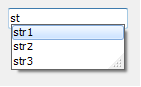
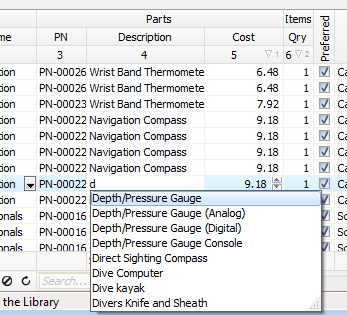

# Working with lists MRUList (last entry list)

All editing control, as well as classes in the grid columns `TColumnEh` (For `DBGridEh`) and `TFieldRow` (For `DBVerGridEh`) contain a `MRUList` property.

This feature is designed to manage a list of the last entries. When you start typing in a text editor, the system displays a list of recently entered values and offers to choose from a list of one of the values to not gain it fully again.

`MRUList` starts only after activation. To activate `MRUList` set `MRUList.Active` property to `True`.
You can complete the list of initial values, using the `MRUList.Items` property of `TStrings` type. When `MRUList` active and filled the `Items` property values, the text editor will display a special list editor under control, offering to choose one of the existing values list. At the same list of values will be limited to only those lines, the values that begin with the string contained in the editor. For a complete list of values, delete the text in the editor and press `VK_BACK`.

The list of `MRUList` values can be formed automatically on the basis of a list of unique values in the `DataSet`. To specify that the data should be taken from the `DataSet` set `MRUList.ListSourceKind` property  to `lskDataSetFieldValuesEh`.

 

Not all `DataSets` support access to the internal data structure for a list of unique values of a column.
In the current version of the library `MRUList.ListSourceKind = lskDataSetFieldValuesEh` mode works for `DataSet` of `TMemTableEh` type. In one of the unit for your project it is necessary to add a `EhLibMTE` module in the uses clause. This module contains a class that is able get unique values for a field.

If your `DataSet` supports the ability to get a list of unique values for a field, then you can write and register your class inherited from `TDatasetFeaturesEh`. In the implementation of the class it must written a `FillFieldUniqueValues` method. See the example of the implementation in the `EhLibMTE.Pas` file.

The `TMRUListEh` class contains the following properties:

`property AutoAdd: Boolean`
<dd>Automatically add new value to the list when the control lost input focus.</dd>

`property Active: Boolean`
<dd>MRUList is active</dd>

`property CaseSensitive: Boolean`
<dd>Search and filter text in the list of sensitive of case</dd>

`property Items: TStrings`
<dd>List of Values </dd>

`property Limit: Integer`
<dd>The maximum number of rows in the list. After reaching the limit value monitoring will delete the oldest value prior to the addition of new.</dd>

`property Rows: Integer`
<dd>The size of the list box. The size is given in text strings.</dd>

`property ListSourceKind: TMRUListSourceKindEh`
<dd>

  Defines a kind of source data for MRU DropDown list.

`lskMRUListItemsEh` – source data for DropDown list will be taken from Items property.

`lskDataSetFieldValuesEh` – source data for DropDown list will be taken from `DataSet`. For `DataSet` a `TDatasetFeaturesEh` class must be registered with implementing of `FillFieldUniqueValues` method to list of unique values for a dataset field.
  
</dd>

