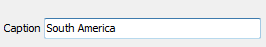
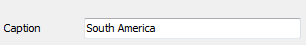

# ControlLabel - signature for the "control" data editing


The `TDBEditEh`, `TDBNumberEditEh`, `TDBComboBoxEh`, `TDBMemoEh`, `TDBLookupComboboxEh`, `TDBImageEh`, `TDBRichEditEh` components are added `ControlLabel` property – the text next to the editing control. `ControlLabel` a class of type `TLabel`, which retain their position on the master control when moving the control to which it is attached. The combination of `TDBEditEh` + `ControlLabel` built on the principle of a standard control - `TLabeledEdit`.
Default `ControlLabel` is not visible. To make `ControlLabel` visible set `EditControl.ControlLabel.Visible` property to `True`.
If `EditControl` is tied to the database field, it displays the title `ControlLabel` field of `Field.DisplayName` property.
To adjust the location of `ControlLabel` use subproperties of `ControlLabelLocation` property:

`property Position: TLabelPositionEh`

<sh>
  position relative to the master control.
  
  `TLabelPositionEh = (lpAboveLeftEh, lpAboveCenterEh, lpAboveRightEh, lpBelowLeftEh, lpBelowCenterEh, lpBelowRightEh, lpLeftTopEh, lpLeftTextBaselineEh, lpLeftCenterEh, lpLeftBottomEh, lpRightTopEh, lpRightTextBaselineEh, lpRightCenterEh, lpRightBottomEh);`
</sh>

property Spacing: Integer
<sh>offset from the master control for the first axes.</sh>

property Offset: Integer
<sh>offset relative to the second coordinate axis of the master control.</sh>

property LabelSpacingBound: TSpacingBoundEh
<sh>Label Sets the border controls with respect to which the measured distance specified property Spacing. 

`TSpacingBoundEh = (sbNearBoundEh, sbFarBoundEh);`

`sbNearBoundEh` – Spacing the distance is relative to the brink of near-Label control.

`sbFarBoundEh` – Spacing The distance is relative to the far verge Label control.
</sh>
<br>

Below are the typical set of values of ControlLabelLocation subproperties:

```pascal
ControlLabelLocation.LabelSpacingBound = sbNearBoundEh
ControlLabelLocation.Spacing = 3
ControlLabelLocation.Position = lpAboveLeftEh
```

<br>
<br>


```pascal
ControlLabelLocation.LabelSpacingBound = sbNearBoundEh
ControlLabelLocation.Spacing = 3
ControlLabelLocation.Position = lpLeftTextBaselineEh
```

<br>
<br>


```pascal
ControlLabelLocation.LabelSpacingBound = sbFarBoundEh
ControlLabelLocation.Spacing = 80
ControlLabelLocation.Position = lpLeftTextBaselineEh
```


