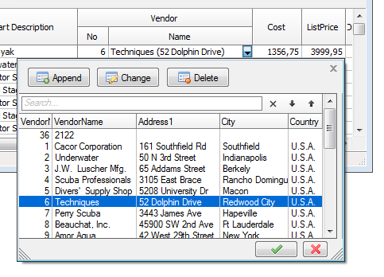
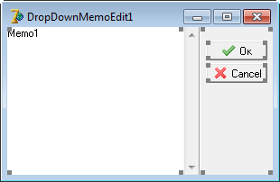
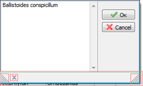

  # DropDownForms - custom drop-down windows

  
Typical `DropDown` window - is a list that appears in the control `TComboBox` when you click on the edit button.
New technology allows you to create a customizable drop-down windows that appears when user click on the button (`EditButton`) in `TDBEditEh`, `TDBNumberEditEh`, `TInplaceEditor` in `DBGridEh` etc. components.



 
Follow next  steps to create and use a DropDown Form:

1. Create a `Form` that is inherited from `TCustomDropDownFormEh` class.
This can be done at `Design-Time` through the menu `File-New-Other` ...-Tab "EhLib Forms"-"DropDown Form" item.
2. Create and arrange controls on the `Form`.
3. Write `Form` event handlers:

`OnInitForm` event - to get the parameters passed from the text editor and initiate the form according to the received parameters.

`OnReturnParams` event - to store the selected value from the Form to the internal structure for the subsequent transmission to a text editor.

4. It is necessary to assign the property `DropDownFormParams.DropDownForm` or `DropDownFormParams.DropDownFormClassName` in a text editor or edit button (`TDBEditEh`, `TDBNumberEditEh`, `DBGridEh.TColumnEh`), where are you going to call the `DropDown Form`, to indicate which `Form` should be called when a user clicks on the edit button.

This is a sufficient minimum set of steps to make `DropDown Form` work at `Run-Time`.

By default, the text editor transmits the value as the first parameter in the Form and writes the resulting value of the first parameter transmitted from the `From` to itself text property.

Let’s look at the steps of creating a `DropDown Forms` with more details.

### Step 1 - Creating a DoprDown Form class.

When creating a `Form` through menu menu `File-New-Other` ...-Tab "EhLib Forms"-Element "DropDown Form" a system call a library code that creates a new `Form` that is inherited from `CustomDropDownFormEh` class.



### Step 2 and 3 - Placing a components on the form and writing event handlers.

At `Run-Time`, working with a `Form` resembles working with a dialog box in a `ShowModal` mode. However, the system closes the `DropDown Form` when the form loses it active state. You can also close the form in the code indicating that the Form must be closed with a "Send the selected value to the calling control" indication. In this case the event in the edit control would be caused to store the selected value. You can also customize that the edit control assigns a selected value to itself automatically.
The Library calls an `TCustomDropDownFormEh.OnInitForm` event before showing the Form. 
It is necessary to initialize the `Form` before displaying and use the transferred data from the caller control.

Here is an example of event handler for `OnInitForm` event:

```pascal
procedure TDropDownMemoEdit1.CustomDropDownFormEhInitForm(
  Sender: TCustomDropDownFormEh; DynParams: TDynVarsEh);
begin
  if DynParams.Count >= 1 then
    Memo1.Lines.Text := DynParams.Items[0].AsString;

  sbOk.Enabled := not ReadOnly;
  Memo1.ReadOnly := ReadOnly;
end;
```

In the above code the check is performed, whether any value was transferred from the `Control` through the `DynParams` parameter. If it was transferred, the value is assigned to a `Memo1`.

`DropDown Form` may be in of `ReadOnly`.  This property is assigned by the transmission control depending of `Control.Field.ReadOnly` value. In the above code, we adjust components of the form according to the state `ReadOnly`. Consider that a `ReadOnly` form will not return any value, and will only be opened to view the data.

### Closing the Form and transferring the selected values

Assign `ModalResult` property by `mrOk` to close the Form with the "Transfer selected value" indication.
Below is a code sample that closes the Form:

```pascal
procedure TDropDownMemoEdit.sbOkClick(Sender: TObject);
begin  
  ModalResult := mrOk;
  Close;
end;
```

The program will close the Form and call `OnReturnParams` event to transfer the selected values in the internal variables.
By default, the system offers to write the selected values in the `DynVars` array that is passed as a parameter.

Below is an example of an `OnReturnParams` event handler:

```pascal
procedure TDropDownMemoEdit1.CustomDropDownFormEhReturnParams(
  Sender: TCustomDropDownFormEh; DynParams: TDynVarsEh);
begin
  DynParams.Items[0].AsString := Memo1.Lines.Text;
end;
```

In our case, we write the text from a `TMemo` to the first item of a `DynParams` collection. The collection will already contain an element, as we have already passed it in the Form using the same collection (This part will be discussed later in the part of customizing the edit control).

### TCustomDropDownFormEh.FormElements property

`TCustomDropDownFormEh` class has a property to define of displaying additional special controls on the `Form`. Use `FormElements` property to specify which additional items have to be placed on the Form in the Run-Time:

`ddfeLeftGripEh` – SizeGrip control in the left corner. This element is used to change a window size.

`ddfeRightGripEh` – SizeGrip element in the right corner of the window.

`ddfeCloseButtonEh` – Close button.

`ddfeSizingBarEh` – The bar at the bottom of the window to change the height of the window by mouse.




### Step 4 – Customizing the calling controls.

There are a `DropDownFormParams` property in the classes that work with text editors, such as `TColumnEh`, `TDBEditEh` etc.,. This property contains sub-properties to configure a `DropDown Form`: to define which form must be shown, how to pass and get parameters to/form the From.

Use the property `DropDownFormParams.DropDownForm` or `DropDownFormParams`. `DropDownFormClassName` to specify the name of the form to be displayed when a user clicks on the `EditButton`.

If `DropDownFormParams.DropDownForm` property is assigned then the `Form` must be created in advance and assigned to a global variable `<DropDownFormName: TDropDownFormName>`, which is created by the project code when creating forms. This creation and assignment occurs automatically when the form is in the list of «Auto-create forms» (see Project properties).

If `DropDownFormParams.DropDownFormClassName` property is assigned then the program will create a form just before showing and destroy it after the Form is closed. To allow the program to find the form designer by the name of the class, form class must be registered using procedure `Classes.RegisterClass`.

This can be done in the initialization part of DropDown Form unit.
Below is an example of registering a class:

```pascal
unit MyDropDownFormUnit1;
…
interface
…
initialization
  RegisterClass(TMyDropDownForm1);
end.
```

There is another way to create a DropDown Form. Form is created before the first display and lives up to the end of the life of the program.
To implement this method follow the next steps:
- Assign the `DropDownFormParams.DropDownFormClassName` property
- Register the class of the Form using `RegisterClass` (TMyDropDownForm1) code.
- Override the virtual `class function TCustomDropDownFormEh.GetGlobalRef: TCustomDropDownFormEh` – to create Form on the first call and assigns it to a global variable.

Below is the sample of code that implements this functionality:

```pascal
type
  TDropDownMemoEdit3 = class(TCustomDropDownFormEh)
…
  public
    class function GetGlobalRef: TCustomDropDownFormEh; override;
  end;

var
  DropDownMemoEdit3: TDropDownMemoEdit3;

implementation
…
class function TDropDownMemoEdit3.GetGlobalRef: TCustomDropDownFormEh;
begin
  if DropDownMemoEdit3 = nil then
    Application.CreateForm(TDropDownMemoEdit3, DropDownMemoEdit3);
  Result := DropDownMemoEdit3;
end;
…
end.
```

### Step 4.1 Assigning parameters from edit control the DropDown Form.

Use `DropDownFormParams.PassParams` property to specify which field values must be passed in the drop-down Form. The property can hold one of the next values:

`pspByFieldNamesEh` - Pass the value of the fields specified in the property DropDownFormParams. PassFieldNames

`pspFieldValueEh` - Pass the current value of the edit control.

`pspRecordValuesEh` - Pass the value of all the fields of the current DataSet record.

In the drop-down form, you can read the transferred value form DynParams collection.

DropDownFormParams property contains the following sub-properties:

Property Name	Property Type	Description
`DropDownForm: 	TCustomForm`	Reference to a DropDown Form.

`DropDownFormClassName: 	String`	Reference to a class that implements DropDown Form.

`Align: 	TDropDownAlign`	Alignment of the DropDown Form relative to the edit control.

`PassParams: 	TDropDownPassParamsEh`	Way of passing the parameters.

`PassFieldNames: 	String`	The name of the DataSet fields, the value of which should be passed in the Form.

`AssignBackFieldNames: 	String`	The name of the DataSet field, the value of which assigned to the values received from the Form.

`FormWidth: 	Integer`	Width of the Form. The Form width is written to the property when the Form is closed.

`FormHeight: 	Integer`	The height of the form. The Form height is written to the property when the Form is closed.

`SaveFormSize: 	Boolean`	The property determines whether to keep the size of the form in the FormWidth and FormHeight properties.


### Example of using DropDown forms:

Examples of using and working with DropDownForms see at the Demo Project:
`<EhLib Archive>\Demos\DropDownForm\Project1.dpr`

compiled project:
`<EhLib Archive>\Demos\Bin\DropDownForm.Exe`

New properties in classes of the library for working with DropDown Forms:
New properties to customize the display drop-down forms appeared in the next classes:

(For DBGridEh)
```
TColumnEh.DropDownFormParams
TColumnEh.EditButtons[i].DropDownFormParams
```

(For DBVertGridEh)
```
TFieldRowEh.DropDownFormParams
TFieldRowEh.EditButtons[i].DropDownFormParams
```
```
TDBEditEh.EditButton.DropDownFormParams
TDBEditEh.EditButtons[i].DropDownFormParams
```

In `EditButtons` for `TDBNumberEditEh`, `TDBDateTimeEditEh`, `TDBComboBoxEh`, `TDBLookupComboBoxEh` controls.
