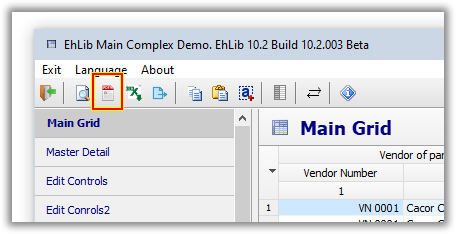

# Export library components to Pdf file


The EhLib library has classes and methods for exporting the `TDBGridEh`, `TDBVertGridEh`, `TPivotGridEh` and `TPlannerControlEh` components to a `PDF` (Portable Document Format) file.

To export data to pdf, the same classes are used that are used to print components.

For `TDBGridEh`, this is the `TPrintDBGridEh` class.
For `TDBVertGridEh`, this is the `TDBVertGridPrintServiceEh` class.
For `TPivotGridEh`, this is the `TPivotGridPrintServiceEh` class.
For `TPLannerEh`, this is the `TPlannerControlPrintServiceEh` class.

Below is a description of the methods for exporting components to pdf.

```pascal
procedure TPrintDBGridEh.PrintToPdfFile(AFileName: String);
```

The `TPrintDBGridEh` class method is used to export data from to pdf format. The data generation algorithm is similar to the algorithm for printing the `TDBGridEh` component using the `TPrintDBGridEh` component.
In the `AFileName` parameter, you must pass the full path and name of the pdf file to be generated.

```pascal
procedure TBasePrintServiceComponentEh.PrintToPdfFile(AFileName: String);
```

The `TBasePrintServiceComponentEh` class method is used to export data from to pdf format. The data generation algorithm is similar to the algorithm for printing the `TDBVertGridEh`, `TPivotGridEh` and `TPLannerEh` component components using classes derived from `TBasePrintServiceComponentEh`.
In the `AFileName` parameter, you must pass the full path and name of the pdf file to be generated.

Below is an example of the code with which the components are exported to a pdf file.

```pascal
procedure TForm1.actExportToPdfExecute(Sender: TObject);
var
  AFilename: String;
  Path: String;
  FullFileName1: String;
  FullFileName2: String;
begin
  GetDir(0, Path);
 
  //PrintDBGridEh1.PrintToPdfFile(FullFileName1);
  if ActiveControl is TCustomDBGridEh then
  begin
    AFilename := 'DBGridEhAsPdf.pdf';
    FullFileName1 := Path + '\' + AFilename;
    PrintDBGridEh1.DBGridEh := TDBGridEh(ActiveControl);
    PrintDBGridEh1.PrintToPdfFile(FullFileName1);
  end else if ActiveControl is TCustomDBVertGridEh then
  begin
    AFilename := 'DBVertGridEhAsPdf.pdf';
    FullFileName1 := Path + '\' + AFilename;
    TCustomDBVertGridEh(ActiveControl).PrintService.PrintToPdfFile(FullFileName1);
  end else if ActiveControl is TCustomPlannerViewEh then
  begin
    AFilename := 'PlannerViewAsPdf.pdf';
    FullFileName1 := Path + '\' + AFilename;
    TCustomPlannerViewEh(ActiveControl).PlannerControl.PrintService.PrintToPdfFile(FullFileName1);
  end else if ActiveControl is TPivotGridEh then
  begin
    AFilename := 'PivotGridEhAsPdf.pdf';
    FullFileName1 := Path + '\' + AFilename;
    TPivotGridEh(ActiveControl).PrintService.PrintToPdfFile(FullFileName1);
  end
  else
  begin
    Exit;
  end;
 
  FullFileName2 := Path + '\' + AFilename + '.Txt';
  CopyFile(PChar(FullFileName1), PChar(FullFileName2), false);
  // ...and start a viewer.
  ShellExecute(Handle, nil, PChar(FullFileName1), nil, nil, SW_SHOWNORMAL);
end;
```
 
Export to pdf is supported in all versions of Delphi under VCL and in Lazarus under Windows.

An example of using the functionality of uploading data to pdf can be found in the Demo project 
`DEMOS\MainDemo\`.

There is a button `Export to pdf` in the Demo project.


 

