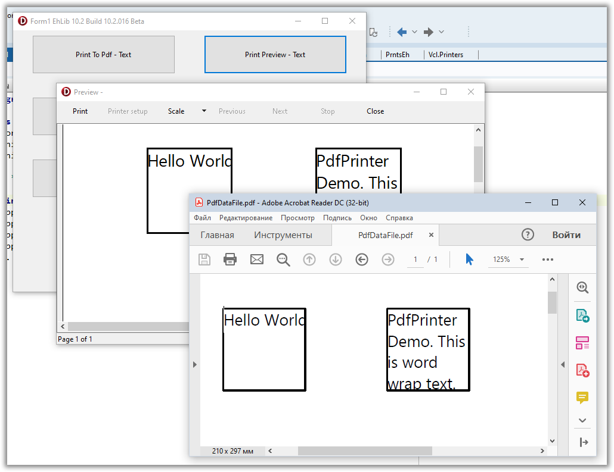

# Generating Pdf Files Using the Printer Class


The library has a global method `PdfPrintersEh.PdfPrinter` for accessing a class of `TPdfPrinterEh` type with which you can generate Pdf files similar to how printed documents are generated using the global `Printers.Printer` method.

Below is an example of using PdfPrinter to generate a pdf file with one page and plain text.

```pascal:no-line-numbers
//Generate graphic data as a pdf file.
procedure TForm1.Button1Click(Sender: TObject);
var
  AFilename: String;
  Path: String;
  FullFileName: String;
begin
  //Generating a path to a file.
  //The file will be created in the current directory.  
  GetDir(0, Path);
  AFilename := 'PdfDataFile.pdf';
  FullFileName := Path + '\' + AFilename;
 
  //Let's start creating a new document.
  //The generated data will be saved in a file at the address
  //specified in the FullFileName variable.
  PdfPrinter.BeginDoc(FullFileName);
  PrintData1To(PdfPrinter);
  PdfPrinter.EndDoc();
 
  //Open the created file for viewing.
  ShellExecute(Handle, nil, PChar(FullFileName), nil, nil, SW_SHOWNORMAL);
end;
 
//Generate graphic data and show result using PrinterPreview Form.
procedure TForm1.Button2Click(Sender: TObject);
begin
  PrinterPreview.BeginDoc;
  PrintData1To(PrinterPreview);
  PrinterPreview.EndDoc;
end;
 
//Generate graphics data using the TBaseVirtualPrinter class
//as the graphics command generation provider.
procedure TForm1.PrintData1To(VirtualPrinter: TBaseVirtualPrinter);
var
  ARect: TRect;
  AText: String;
  Ppx, Ppy: Integer;
begin
  //Get the number of pixels per inch to form data in 1 by 1-inch squares.
  Ppx := VirtualPrinter.Canvas.PixelsPerInchX;
  Ppy := VirtualPrinter.Canvas.PixelsPerInchY;
  VirtualPrinter.Canvas.Brush.Style := bsClear;
 
  ARect := Rect(Ppx, Ppy, Ppx + Ppx, Ppy + Ppy);
 
  //1x1 inch Square.
  VirtualPrinter.Canvas.Pen.Width := Ppx div 50;
  VirtualPrinter.Canvas.Rectangle(ARect);
 
 
  //Text
  AText := 'Hello World!';
  VirtualPrinter.Canvas.Font.Size := 14;
  VirtualPrinter.Canvas.TextRect(ARect, AText, []);
 
  //Wrapped Text
  ARect.Offset(Ppx * 2, 0);
  VirtualPrinter.Canvas.Rectangle(ARect);
 
  AText := 'PdfPrinter Demo. This is word wrap text.';
  VirtualPrinter.Canvas.TextRect(ARect, AText, [tfWordBreak]);
end; 
``` 

When `Button1` is clicked, the `Button1Click` event handler is called.
In the handler:
- Create path to pdf file
- The method for starting the formation of a pdf document is called.
- The PrintData1To method is called, to which a virtual printer of the PdfPrinter type is passed.

The `Button2` button has a `Button2Click` event handler in which the graphic data stream is redirected to the Print Data Preview Form.
The `PrintData1To` method directly generates graphic data.
The method code draws two squares with text. In the second square, text with word wrapping is displayed.
Below you can see the result of both events.
 


For an example of generating `Pdf` files using the `TPdfPrinterEh` method, see the library archive in the Demo project:
	`<EhLib Archive>\Demos\PdfPrinter\Project1.dpr`

In the current implementation, the `TPdfPrinterEh` class has a number of limitations and features:
- `Canvas.Handle` property is not supported in `TPdfPrinterEh`. This means that you will not be able to use methods such as `GetDeviceCaps` that need to pass the `Handle` of the graphics device.

- To print formatted `Rtf` text, use the `DrawRtfText` and `MeasureRtfTextLayout` methods of the `TVirtualPrinter.Canvas` class. 
The `TPdfPrinterEh` class does not support formatting individual sections within a paragraph.

- For information about dots per inch, use the `TVirtualPrinter.Canvas.PixelsPerInchX` and `TVirtualPrinter.Canvas.PixelsPerInchY` properties.

- To set the clipping area, use the `TVirtualPrinter.Canvas.AppendClipRect` and `RestoreClip` methods. Methods must work in pairs.