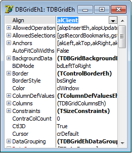

# View properties of components at Run-Time

When using the library it is possible to call a special `Form` of `Object Inspector` type. This form can be used to debug the component at run time by changing the values of the component properties.



To start using the form, add the unit `ObjectInspectorEh` in the Uses section of your module and call the global procedure - `ShowObjectInspectorForm`.

The procedure shows a `Form` with a list of properties the explored component in the same manner as `Design-Time` Object Inspector. You can use it to configure the properties of the components at `Run-Time`.

The procedure has the following parameters:
```pascal:no-line-numbers
procedure ShowObjectInspectorForm(
                  Component: TObject; // Component to inpsect
                  FormBounds: TRect;  // Bounds of the Form
                  NewForm: Boolean = False // Show as a new Form
);
```
