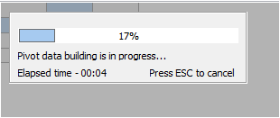

# Indicator data generation TPivotGridEh with the possibility of interrupting the process

In `TPivotGridEh` during long formation of data indicator (ProgressBar) of data generation is displayed with the possibility of interruption by pressing ESC key.

Method of forming data remains the same. To generate the data `TPivotDataSourceEh.BuildPivotData` method is used;
To control the displaying of the progress bar use the following properties of TPivotGridEh class:

`ShowDataBuildingProgress: Boolean`
Defines necessity of displaying indicator during data formation.

`DataBuildingProgressDelay: Integer`
Defines interval (in milliseconds) after which it is necessary to display indicator. If data formation time less than specified interval then indicator will not be shown.

