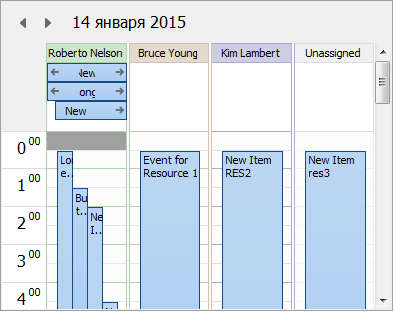
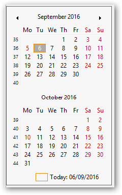

# Components for planning and visual interactive event management


The library contains a set of components for planning and visual interactive control events tied to a specific period of time.

##### Component TPlannerDataSourceEh
 TPlannerDataSourceEh component is used for storing TPlannerDataItemEh objects-events.

##### Component TPlannerControlEh.
The visual component-container TPlannerControlEh contains a set of PlannerView visual components.
Each of the PlannerView components displays period of time and events on it in a specific format.
On screenshot on the left side TPlannerControlEh component contains PlannerView of TPlannerDayViewEh type, which displays a set of events for one day.



In current version PlannerView elements can have one of the following types:
-	`TPlannerDayViewEh` 	Displays an interval of time one day long and events fall into it.
-	`TPlannerWeekViewEh` 	Displays an interval of time one week long and events fall into it.
-	`TPlannerMonthViewEh` 	Displays an interval of time one month long and events fall into it.
-	`TPlannerVertDayslineViewEh`	Displays an interval of time of different length in vertical orientation with cells length of one day.
-	`TPlannerVertHourslineViewEh`	Displays an interval of time of different length in vertical orientation with cells length of one hour.
-	`TPlannerHorzHourslineViewEh`	Displays an interval of time of different length in horizontal orientation with cells length of one day.
-	`TPlannerHorzDayslineViewEh`	Displays an interval of time of different length in horizontal orientation with cells length of one hour.
- `TPlannerHorzYearViewEh`	Displays a one-year time long in horizontal orientation with one-day cells.
  
`TPlannerControlEh` component contains PlannerView components by analogy as a `PageControl` standard component contains a set of TabSheets bookmarks.

Time divider of 5, 6, 10, 15, 30 and 60 minutes in `TPlannerDayViewEh` and  `TPlannerWeekViewEh` components

In `TPlannerDayViewEh` and `TPlannerWeekViewEh` controls a `BarTimeInterval` property was added. The property have `TPlannerBarTimeIntervalEh` type.

`TPlannerBarTimeIntervalEh = (pbti5MinEh, pbti6MinEh, pbti10MinEh, pbti15MinEh, pbti30MinEh, pbti60MinEh);`

The property specifies the length (In minutes) of one time data row in the PlannerView.

### Using the context menu in the components PlannerView

All components such as PlannerView have `PopupMenu` property and `OnContextPopup` event.
Context Menu is  defined by `PlannerView.PopupMenu` property. `PopupMenu` is displayed when user right-click on any cell of `PlannerView` control.

In addition to the functional of component thera are properties and events to display the context menu when the user clicked the right mouse button over the SpanItem element.

In this case, use `PlannerControl.TimeSpanParams.PopupMenu` property and `PlannerControl.OnPlannerSpanItemContextPopup` event.


### List of PlannerView events:

```pascal:no-line-numbersproperty OnContextPopup: TContextPopupEvent;
property OnContextPopup: TContextPopupEvent;

TContextPopupEvent = procedure(Sender: TObject; 
  MousePos: TPoint; var Handled: Boolean) of object;
```


<dd>

  The event is called before context Menu is shown.
  In the event you can set up the context menu items before displaying.
  In the event you can display the context menu in your code and set the Handled parameter to True.
  For example of event handle, see the demo project
   `<EhLib archive>\Demos\PlannerEh.MainDemo\`, in FrameOne.pas module.
</dd>
<br>


```pascal:no-line-numbers
property OnDrawCell:  TPlannerViewDrawCellEventEh;

TPlannerViewDrawCellEventEh = procedure (PlannerView: TCustomPlannerViewEh;
    ACol, ARow: Integer; ARect: TRect; State: TGridDrawState;
    CellType: TPlannerViewCellTypeEh; ALocalCol, ALocalRow: Integer;
    ADrawCellArgs: TPlannerViewCellDrawArgsEh; var Processed: Boolean) of object;
```

<dd>
  Event is called before rendering PlannerView cell.
  In the event you can change the cell drawing parameters by setting new values in ADrawCellArgs parameter.
  In the event you can draw the contents of the cell using the methods of PlannerView.Canvas class and set the Processed to True.
</dd>
<br>

```pascal:no-line-numbers
property OnReadPlannerDataItem: TPlannerViewReadDataItemEventEh   

TPlannerViewReadDataItemEventEh = procedure (PlannerControl: TPlannerControlEh;
PlannerView: TCustomPlannerViewEh; 
DataItem: TPlannerDataItemEh; 
var ReadDataItem: Boolean) of object;
```

<dd>
  This event is fired when reading data of TPlannerDataItemEh from DataSoruce to PlannerView.
  In the event handler you can determine whether you want to read a particular item / event from PlannerDataSourceEh.
  Set the value to False to prevent ReadDataItem from reading.
</dd>
<br>

```pascal:no-line-numbers
property OnSelectionChanged: TNotifyEvent; 
```

<dd>The event is fired when the current selected TPlannerDataItemEh element is changed. In the event you can update the status of the buttons or menu items that dependent on the selected item in TPlannerDataItemEh PlannerView.</dd>
<br>

```pascal:no-line-numbers
property OnSpanItemHintShow: TPlannerViewSpanItemHintShowEventEh

  TPlannerViewSpanItemHintShowEventEh = procedure(PlannerControl: TPlannerControlEh;
    PlannerView: TCustomPlannerViewEh; 
    CursorPos: TPoint; SpanRect: TRect;
    InSpanCursorPos: TPoint; 
    SpanItem: TTimeSpanDisplayItemEh;
    Params: TPlannerViewSpanHintParamsEh; 
    var Processed: Boolean) of object;
```

Write the event handler to change the text, font or background in the window display tips.
This event is fired when prompted to SpanItem element.
For more information about the event, see the section – «Show Hint Winow for planner Items».


### Component TPlannerCalendarPickerEh
The visual component- calendar is designed to navigate through days of a month.
On select a date in the calendar, the component automatically sets the current day in tied `TPlannerControlEh` component. For bundles of two components using the property type `TPlannerCalendarPickerEh.PlannerControl` TPlannerControlEh.

For linking two components use  `TPlannerCalendarPickerEh.PlannerControl` property of `TPlannerControlEh` type.

On changing the current period directly in `TPlannerControlEh` or through `TPlannerCalendarPickerEh`, component `PlannerControl` each time refers to the `TPlannerDataSourceEh` tied component to get a list of `TPlannerDataItemEh` objects-events for the required period.

Communication of `PlannerControl` and `PlannerDataSource` components performs through `TPlannerControlEh.TimePlanSource` property of `TPlannerDataSourceEh` type.



`TPlannerCalendarPickerEh` have the has the following features:
- Allows to highlight the holidays and weekends.
- Allows to highlight current day.
- Allows to display a link to today.

### Loading elements-events from DB or another storage.
Data about events is loaded into `TPlannerDataSourceEh` in the program code similar to the following example:

PlanItem := PlannerDataSourceEh1.NewItem();
PlanItem.ItemID := MyDataSet1['Id'];
PlanItem.StartTime := MyDataSet1['StartTime'];
... 
PlannerDataSource.FetchTimePlanItem(PlanItem);

You are reading event data from the database into an internal `DataSet`.
In the cycle by using a `NewItem.TPlannerDataItemEh` method the plan element is created.
Fill properties of element.
Element is recorded in an event collection by `FetchTimePlanItem` method.

Another way of data loading – through binding of DataSet and fields of DataSet.
For binding setup use sub-properties of `TPlannerDataSourceEh.ItemSourceParams` property.

Set the `TPlannerDataSourceEh.ItemSourceParams.DataSet` property to `DataSet` which should be used to load data from.
Fill `TPlannerDataSourceEh.ItemSourceParams.FieldsMap` collection with `TItemSourceFieldsMapItemEh` elements to set link between DataSet field and property of TPlannerDataItemEh element-event.

`TPlannerDataItemEh` class has the following properties:

`property Title: String;`
<dd>The property specifies the event title or plan element.</dd>
<br>


`property Body: String;`
<dd>The property specifies the detailed description of the event or plan element.</dd>
<br>

`property StartTime: TDateTime;`
<dd>The property sets the commencement of the event.</dd>
<br>
	

`property EndTime: TDateTime;`
<dd>The property sets the expiration date of the event.</dd>
<br>


`property AllDay: Boolean;`
<dd>Property indicates that the event lasts all day.</dd>
<br>


`property ResourceID: Variant;`
<dd>The property specifies the link to the resource is assigned to the event. List PlannerDataSourceEh.Resources resources stored in the collection. Before downloading the event are encouraged to download a list of resources from your database similar to the onload event.</dd>
<br>


`property ItemID: Variant;`
<dd>Event ID. The identifier is proposed to use a unique key in the table that you keep a list of events on the side of the database.</dd>
<br>


`property FillColor: TColor;`
<dd>The color of the event. You can set the default color to Default.</dd>
<br>


`property ReadOnly: Boolean;`
<dd>The property specifies that the user is not allowed to modify the contents or move the timeline event.</dd>
<br>


### Uploading of changed elements to DataBase.
On any change of an element of `PlannerDataItem` event `TPlannerDataSourceEh` component calls `OnApplyUpdateToDataStorage` event where it is necessary to write a code for transfering properties of changed `PlannerDataItem` element to the database.

The event code can look as follows:

```pascal:no-line-numbers
TimePlanSource: TPlannerDataSourceEh; PlanItem: TPlannerDataItemEh;
  UpdateStatus: TUpdateStatus);
begin
  if UpdateStatus = usModified then
  begin
    if mtPlannerData.Locate('Id', PlanItem.ItemID, []) then
    begin
      mtPlannerData.Edit;
      mtPlannerData['StartTime'] := PlanItem.StartTime;
      mtPlannerData['EndTime'] := PlanItem.EndTime;
      mtPlannerData['Title'] := PlanItem.Title;
      mtPlannerData['Body'] := PlanItem.Body;
      mtPlannerData['AllDay'] := PlanItem.AllDay;
      mtPlannerData['ResourceID'] := PlanItem.ResourceID;
      mtPlannerData.Post;
    end else
      raise Exception.Create('Can'' locate record with "Id"=' + 
                             VarToStrDef(PlanItem.ItemID, '<Null>'));
```

In this example changed data in `PlanItem` event is transferred to the TMemTableEh (TDataSet) - mtPlannerData.
 
### Resources and events.

`TPlannerDataSourceEh` component also contains the concept of resources.
Each event can be linked to one of the resources from the collection of resources.
If the list of events is the list of tasks which should be performed by a person, then list of resources is list of people one of which can be assigned to perform a specific task.

To access the elements of the collection use a sub-properties of `TPlannerDataSourceEh.Resources` property.

Typically, a collection of resources is filled before completing the collection of `PlanItem` events. 

Filling the collection of resources is done in the code like this 

```pascal:no-line-numbers
with TimePlanSourceEh1.Resources.Add do
begin
  Name := mtResource.FieldByName('Name').AsString;
  ResourceID := i;
end; 
```

See demo project in the folder `<EhLib Archive>/DEMOS/PlannerEh.MainDemo`
