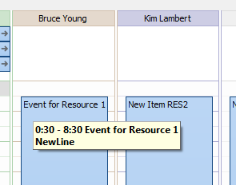

# Show Hint Winow for planner Items


There are event in the `PlannerView` to set data for hint window (Hints) that appear when mouse you hover over the event item area.

```pascal:no-line-numbers
OnSpanItemHintShow: TPlannerViewSpanItemHintShowEventEh
```

<dd>

  Write the event handler to change text, font or background color.
  The hint window is appeared when a mouse moves and hold over the event area (`TPlannerDataItemEh`).
  
  
  In the below example the `OnSpanItemHintShow` handler adds a new line with text 'NewLine' and sets the hint font in bold style.
</dd>

```pascal:no-line-numbers
procedure TfrFrameOne.PlannerDayViewEh1SpanItemHintShow(
  PlannerControl: TPlannerControlEh; PlannerView: TCustomPlannerViewEh;
  CursorPos: TPoint; SpanRect: TRect; InSpanCursorPos: TPoint;
  SpanItem: TTimeSpanDisplayItemEh; Params: TPlannerViewSpanHintParamsEh;
  var Processed: Boolean);
begin
  PlannerControl.DefaultFillSpanItemHintShowParams(PlannerView,
    CursorPos, SpanRect, InSpanCursorPos, SpanItem, Params);
  Params.HintStr := Params.HintStr + sLineBreak + 'NewLine';
  Params.HintFont.Style := Params.HintFont.Style + [fsBold];
  Processed := True;
end;
```

On the screen the hint will appear as follows:


