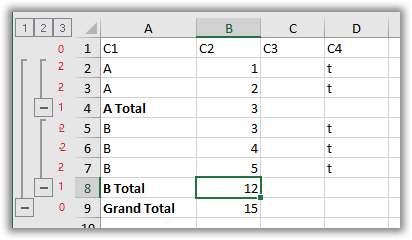

# Setting grouping in rows and columns of a table.

To set up grouping rows in a table, you must correctly fill in the `OutlineLevel` and `OutlineNodeCollapsed` properties of the `TXlsFileRowEh` class in the `Worksheet`.

`Rows` collection or `Worksheet.Columns` if you are grouping columns.

`OutlineLevel` sets the grouping level of the entry.

In the screenshot below, the values that must be assigned to the OutlineLevel property for each table record are indicated in red.

 
Rows 1 and 9 have grouping level zero.

Record number 1 is a table header and does not participate in the grouping.

Record number 9 is a level 1 group heading. The level heading must have a value in OutlineLevel one less than the level of the group it describes (Group Heading 1 - 1 = 0)

Records 4 and 8 are headers for the level 2 group. Accordingly, `OutlineLevel contains the value 1.

For records 4, 8 and 9, you can also specify that the group is collapsed. To do this, set the `OutlineNodeCollapsed` property to `True`. In this case, also, for records that are included in the collapsed group, you must set the `Visible` property to `False`.

If the group header records are above the group, then the `TXlsWorksheetEh.OutlineRowsSummaryBelow` property must be set to `False`.

The `OutlineLevel` and `OutlineNodeCollapsed` properties for the `TXlsFileColumnEh` classes are filled in the same way when grouped by columns.
