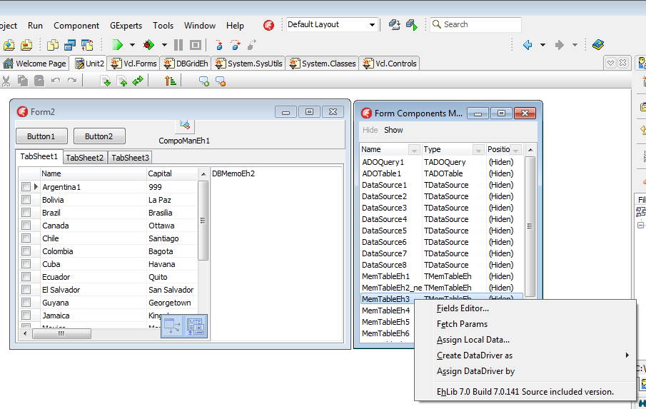

# Hiding a component form in Design-Time

`TCompoManEh` component
`TCompoManEh` component is intended for use only in the `Design-Time`.
`TCompoManEh` can hide other components form during development, thereby enabling to see the design of the form as close to the design mode `Run-Time`.

The upper screenshot the form is whown at `Desig-Time`. 
All components, except the `TCompoManEh`, are hidden by a component editor `CompoManEh1`. The right side of the screenshot you can see a window with a list of hidden components. The window opens when you double-click on `CompoManEh1`. The window contains all the components form `TForm2`. Right-click on the component from the list of Popup Menu Editor opens the selected components.

 
